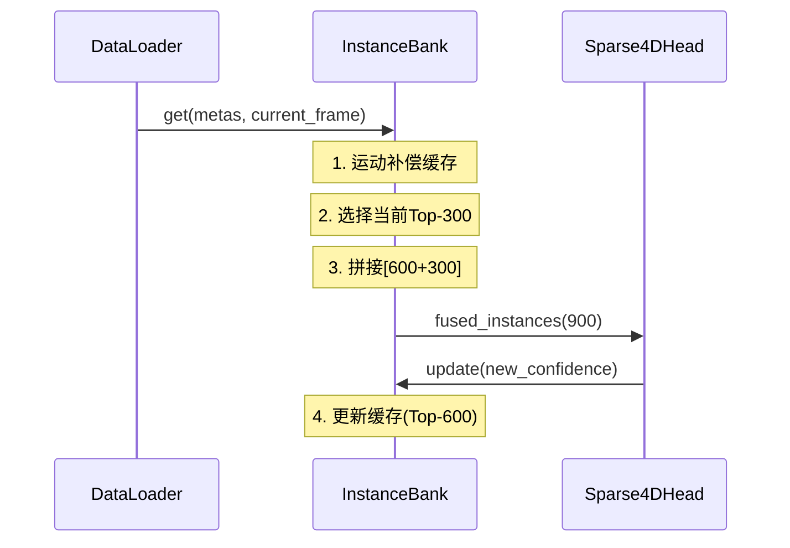
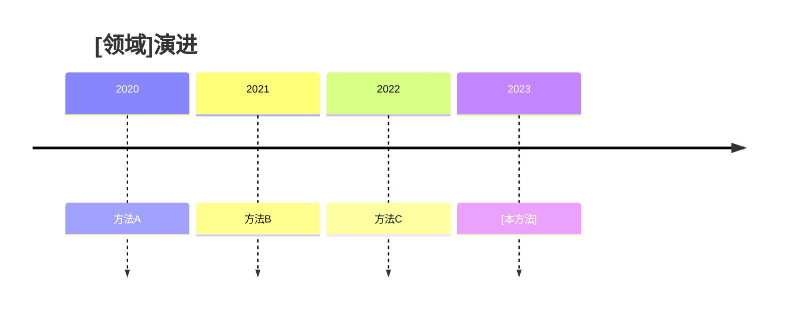

# 🎓 AI IDE 代码库分析提示词模板 (v3.0 - 终极版)

<!-- 修订日志 -->
<!-- v1.0: 初始完整草稿 -->
<!-- v2.0: 添加防幻觉检查、结构化自我修正 -->
<!-- v3.0: 领域专用模板、课后作业系统、对比框架 -->

## 📋 概述

本提示词指导 AI IDE 为深度学习代码库创建**全面、准确、教学严谨**的学习指南，适用领域：
- 🚗 自动驾驶（BEV感知、占据预测、端到端规划）
- 🤖 具身智能（导航、操作、世界模型）
- 🧠 视觉-语言-动作（VLA）模型
- 🌍 世界模型（视频预测、动力学学习）
- 🎯 端到端学习（传感器到动作）

**核心原则**：每个陈述必须**可从代码验证**。禁止猜测，禁止幻觉。

**🌐 语言要求**：
- ✅ **所有输出文档必须使用中文**
- ✅ 代码注释使用中文
- ✅ 变量名、函数名保持英文（遵循代码规范）
- ✅ 技术术语首次出现时：中文（英文）双语标注

---

## 🎯 核心目标

创建一份**完全掌握指南**，使学习者能够：
1. ✅ 理解从继承到实现的完整架构
2. ✅ 以数学严谨性掌握核心算法
3. ✅ 用具体形状追踪整个管道的数据流
4. ✅ 有效调试和优化代码
5. ✅ 与相关方法对比（横向对比）
6. ✅ 理解项目内部演进（纵向对比）

**目标完成时间**：4-6小时专注学习

**🎓 教学核心原则**：

### 1. 叙事优先（Narrative-First）
- ❌ **错误**：直接展示代码 → 孤立的片段 → 死记硬背
- ✅ **正确**：讲故事 → 建立上下文 → 展示代码 → 边读边理解

每个章节必须遵循「**5W1H叙事框架**」：
1. **WHY**（为什么）：这个模块为什么存在？解决什么问题？
2. **WHERE**（在哪里）：在整体系统中处于什么位置？
3. **WHAT**（是什么）：核心功能是什么？
4. **HOW**（怎么做）：如何实现的？（代码层面）
5. **WHEN**（何时用）：什么时候被调用？
6. **WHO**（谁调用）：上游和下游是谁？

### 2. 描述性文字比例要求
**强制规则**：
- 描述性文字（叙事、解释、逻辑）：**60-70%**
- 代码片段：**20-30%**
- 图表/公式：**10-20%**

**❌ 禁止模式**：
```python
# 错误示例：代码 + 简短孤立注释
def forward(self, x):
    # 特征提取
    feat = self.extract(x)  
    # 融合
    out = self.fuse(feat)
    return out
```

**✅ 正确模式**：
```markdown
### 为什么需要这个forward函数？

在Sparse4D系统中，我们面临一个核心挑战：如何将6个相机的2D图像
转换为统一的3D空间表示？这个forward函数就是解决这个问题的关键。

它在整个系统中扮演"多视角协调器"的角色：
- 上游：接收来自数据加载器的原始图像 (B, N=6, 3, H, W)
- 下游：为检测头提供融合后的3D特征 (B, M=900, C=256)

**工作流程**（三个阶段）：

阶段1：特征提取（为什么需要？因为原始像素无法直接用于3D推理）
- 输入：6张高分辨率图像 (6, 3, 928, 1600)
- 操作：通过ResNet提取多尺度特征
- 输出：4个尺度的特征图 (6, 256, H/8, W/8) 到 (6, 256, H/64, W/64)
- 代码位置：projects/.../sparse4d.py:72-75

阶段2：多视角融合（为什么需要？因为3D物体可能跨多个相机）
...

现在看代码就很清晰了：
```python
# 文件：projects/mmdet3d_plugin/models/sparse4d.py
# 行号：62-90
def forward(self, x):
    # 阶段1：特征提取（详见上文解释）
    feat = self.extract(x)  # (B*N, 3, H, W) → (B*N, 256, H', W')
    
    # 阶段2：多视角融合（详见上文解释）  
    out = self.fuse(feat)   # (B*N, 256, H', W') → (B, M, 256)
    return out
```
```

### 3. 系统上下文强制要求
每个代码片段必须配有「**上下文定位图**」：
```markdown
📍 **当前位置**：
Sparse4D系统全景
├── [灰色] 数据加载
├── [灰色] 图像增强
├── [高亮] 👉 特征提取 ← 你在这里
├── [灰色] 时序融合
├── [灰色] 检测头
└── [灰色] 后处理
```

### 4. 渐进式理解检查点
每300行必须插入「**理解检查点**」：
```markdown
### ✋ 暂停：你现在应该能回答

不看代码，用自己的话解释：
1. 为什么需要多尺度特征？（提示：不同大小的物体）
2. 这个模块的输入输出分别是谁？（画个箭头图）
3. 如果去掉这个模块会怎样？（系统会缺少什么能力）

如果答不上来，重新阅读上一节的「WHY」和「WHERE」部分。
```

**关键规则**：🚨 **代码即真理** 🚨
- 每个声明必须引用文件路径 + 行号
- 每个形状必须用具体示例验证
- 每个"功能"必须有代码证据
- 如不确定，明确标记为"需要验证"并调查

---

## 📚 必需的文档结构

### 文件组织

在 `test_wl/` 目录下创建结构化文档：

```
test_wl/
├── [项目名]_完全掌握指南.md           # 主学习指南
├── 算法横向对比.md                     # 横向对比: vs 其他方法
├── 版本演进分析.md                     # 纵向对比: V1→V2→V3 变化
├── 快速参考手册.md                     # API参考、关键配置
├── 常见问题与陷阱.md                   # 常见问题 & 解决方案
└── 课后自测题.md                       # 30道题目 + 答案
```

### 主指南结构

```markdown
# [项目名] 完全掌握指南

## ✨ 文档状态
- 总章节数：0-5
- 总行数：~XXXX
- 完成度：[百分比]
- 最后更新：[日期]

## 📖 如何使用本指南
1. 按顺序学习各章节（不要跳过！）
2. 每章后完成自查问题
3. 边阅读边追踪代码（不要只是被动阅读）
4. 完成课后自测题.md中的作业
5. 编码时参考快速参考手册.md

## 第0章：架构基础 (⏱️ 60分钟) ⭐⭐⭐
### 0.1 继承链完整分析
- 完整的7层（或N层）层次结构
- 每个类的文件路径 + 精确行号
- 每层添加了什么（附代码证据）
- 每层为什么存在（设计理由）
- 验证：你能凭记忆画出继承树吗？

### 0.2 设计哲学
- 核心原则（如"BEV表示"、"时序融合"）
- 做出的权衡（精度vs速度，内存vs计算）
- 与替代方案的比较（为什么选择这个设计？）

## 第1章：核心架构总览 (⏱️ 40分钟) ⭐⭐⭐⭐
### 1.1 系统架构图
- Mermaid图：输入 → 模块 → 输出
- 清晰标记组件职责
- 每个组件的文件位置

### 1.2 完整数据流
- 输入格式和形状
- 每个模块的转换（含形状）
- 输出格式和解释
- 训练vs推理的差异

### 1.3 关键形状转换表
```
模块             | 输入形状           | 输出形状           | 文件:行号
-----------------|--------------------|--------------------|----------
主干网络         | (B,N,3,H,W)       | (B,N,C,H',W')     | xxx.py:123
...
```

## 第2章：算法深度剖析 (⏱️ 120-180分钟) ⭐⭐⭐⭐⭐
### 每个算法章节的模板：

#### 2.X [算法名称] (⏱️ XX分钟)

---

### 📖 章节导读（必需，200-300字）

用讲故事的方式建立完整背景：

**🎬 故事背景**：
想象你正在开发一个自动驾驶系统。你已经有了[前置模块的输出]，
现在面临一个具体问题：[描述实际场景中的挑战]。

例如："你的系统现在能识别当前帧的车辆，但是...
- 视频抖动导致检测框跳跃
- 被遮挡时目标丢失
- 无法预测其他车的轨迹
这时你需要：时序信息！但直接缓存10帧图像需要1GB内存..."

**🎯 本章要解决的核心矛盾**：
[矛盾A] vs [矛盾B]
例如："高精度（需要长时序） vs 低内存（无法缓存多帧）"

**💡 解决方案的核心洞察**（一句话）：
"与其缓存图像，不如缓存高置信度的检测结果！"

**📍 在系统中的位置**：
```
Sparse4D系统流程
[已完成] 图像编码 → [已完成] 特征提取 → [你在这里👉] 时序融合 → [待处理] 检测头
                                          ↑
                                    本章重点
```

---

### 🔍 WHY - 为什么需要这个算法？（必需，150-200字）

**不用这个算法会怎样？**
- 问题1：[具体现象] → 影响：[量化指标下降]
- 问题2：[具体现象] → 影响：[量化指标下降]

**历史方案的局限**：
- 方法A（如Sparse4D v1）：[描述] → 缺点：[具体数据，如"内存占用1.2GB"]
- 方法B（如BEVDet）：[描述] → 缺点：[具体数据]

**为什么现有方法不够好？**
用通俗语言解释技术瓶颈（避免术语堆砌）

---

### 📍 WHERE - 在系统中的精确位置（必需）

**调用链**：
```
训练流程：
DataLoader → Sparse4D.forward_train() → extract_feat() → 
👉 InstanceBank.get() ← 你在这里 → Sparse4DHead.forward() → Loss

推理流程：
Image → Sparse4D.forward_test() → extract_feat() →
👉 InstanceBank.get() ← 你在这里 → Sparse4DHead.forward() → NMS → 结果
```

**输入来源**（谁调用我？）：
- 调用者：`Sparse4DHead.forward()` (文件:行号)
- 输入数据：
  - `feature_maps`: (B, N=6, C=256, H/8, W/8) - 来自图像编码器
  - `metas`: 包含时间戳、ego运动等元信息
  - `cached_instances`: (B, 600, 256+11) - 上一帧的缓存

**输出去向**（我调用谁？）：
- 使用者：`Sparse4DHead.forward()` 继续处理
- 输出数据：
  - `fused_instances`: (B, 900, 256) - 融合后的实例特征
  - `fused_anchors`: (B, 900, 11) - 融合后的锚框

**生命周期**：
- 初始化：训练开始时（第0帧）
- 更新：每帧调用 `get()` 和 `update()`
- 重置：新视频序列开始时

---

### 🎯 WHAT - 核心功能是什么？（必需，100-150字）

用一句话概括：
"[算法名]通过[核心机制]实现了[核心目标]，使得[关键指标]从X提升到Y。"

例如：
"递归时序融合通过**缓存高置信度实例而非图像**，实现了**O(1)复杂度的多帧融合**，
使得内存从1.2GB降至0.4GB，FPS从6.1提升到15.3。"

**功能分解**（3个子功能）：
1. [子功能1]：[一句话描述] - 对应代码：文件.py:L100-150
2. [子功能2]：[一句话描述] - 对应代码：文件.py:L151-200
3. [子功能3]：[一句话描述] - 对应代码：文件.py:L201-250

---

### 🧮 数学原理（保持原模板）

**符号定义表**（先定义所有符号）：
| 符号 | 含义 | 形状 | 物理意义 |
|------|------|------|----------|
| $A_t$ | 第t帧锚框 | (B, M, 11) | 3D边界框的11维表示 |
...

**核心公式**（每个公式必须配文字解释）：

公式1：[用人话说这个公式在干什么]
$$
[LaTeX公式]
$$
- 为什么这样设计？[设计理由]
- 与公式2的关系：[逻辑联系]

**🔢 数值示例**（必需，手工计算一个具体例子）：
```
场景：2辆车的跟踪问题

第t-1帧：
- 车A：位置(10, 5, 0)m，速度(5, 0, 0)m/s，置信度0.9
- 车B：位置(-3, 8, 0)m，速度(3, 2, 0)m/s，置信度0.7

时间间隔：Δt = 0.5s

ego运动：向前移动2m，向右转5°

步骤1：运动补偿
车A投影位置 = R(5°) · [(10,5,0) + 0.5·(5,0,0)] + (-2,0,0)
             = R(5°) · (12.5, 5, 0) + (-2, 0, 0)
             = (12.3, 6.1, 0) + (-2, 0, 0)
             = (10.3, 6.1, 0)  ← 这就是第t帧的预测位置

步骤2：置信度衰减
车A置信度 = 0.9 × 0.6 = 0.54
车B置信度 = 0.7 × 0.6 = 0.42

步骤3：与当前帧Top-K融合
...
```

---

### 💻 HOW - 代码实现（重新组织）

**实现概览**（先给大图）：
```python
# 伪代码：展示逻辑流程（非真实代码）
class InstanceBank:
    def get(self):  # 获取融合后的实例
        # 步骤1：运动补偿（30行代码）
        if has_cache:
            cache = motion_compensate(cache, ego_motion, dt)
        
        # 步骤2：递归融合（20行代码）
        instances = concat([cache, current_top_k])
        
        # 步骤3：更新缓存（15行代码）
        self.cache = select_top_n(instances, n=600)
        
        return instances
```

**详细实现**（分段讲解，每段50-100行）：

#### 代码段1：运动补偿（为什么需要？因为ego车在移动）

**这段代码在解决什么问题？**
上一帧的锚框坐标是相对于「上一帧的ego车」，但现在ego车已经移动了。
如果不补偿，历史车辆的位置会错位。

**输入输出**：
- 输入：`cached_anchor` (B, 600, 11) - 上一帧的锚框
- 输入：`T_global` (B, 4, 4) - ego运动矩阵
- 输出：`projected_anchor` (B, 600, 11) - 投影到当前帧的锚框

```python
# 文件: projects/mmdet3d_plugin/models/instance_bank.py
# 行号: 98-111

# 计算ego运动变换矩阵
T_temp2cur = compute_transform(
    T_global_inv=metas["T_global_inv"],  # 当前帧的世界坐标
    T_global_prev=self.metas["T_global"]  # 上一帧的世界坐标
)  # → (B, 4, 4)
# 💡为什么这样计算？因为 T_temp2cur = T_cur^{-1} · T_prev
#    先从上一帧坐标系转到世界坐标系，再转到当前帧坐标系

# 执行锚框投影
projected_anchor = self.anchor_handler.anchor_projection(
    self.cached_anchor,           # (B, 600, 11) - 待投影的锚框
    transformation=[T_temp2cur],  # List[(B, 4, 4)] - 变换矩阵
    time_intervals=[-time_interval],  # 负值表示从过去投影到现在
)[0]  # → (B, 600, 11)
# 💡为什么时间间隔是负值？因为运动方向是 t-1 → t（向未来）
```

**🔍 逐行解读**（只解读关键行）：
- L98-102：计算变换矩阵
  - 为什么需要？[理由]
  - 形状变化：无（矩阵乘法）
- L104-111：投影锚框
  - 为什么需要？[理由]
  - 内部做了什么？（指向anchor_projection的详细解释）

#### 代码段2：递归融合
[同样的结构]

#### 代码段3：缓存更新  
[同样的结构]

---

### 🎨 可视化（必需）

**流程图**（展示算法的时序）：


**状态图**（展示数据流动）：
[保持原模板]

---

### ⚠️ 常见陷阱（保持原模板，但增加"为什么会犯这个错误"）

**陷阱1：时间间隔符号错误**
- ❌ 错误代码：`time_intervals=[time_interval]`（正值）
- ✅ 正确代码：`time_intervals=[-time_interval]`（负值）
- 🤔 为什么容易错？因为直觉上"从过去到现在"感觉应该是正数
- 💡 记忆技巧：负号表示"逆时间"投影（t-1 → t）
- 📍 代码位置：instance_bank.py:L107

---

### ✅ 理解检查点（新增）

完成本节后，闭上眼睛回答：

1. **电梯演讲**（30秒解释给非技术人员）：
   "递归时序融合就像...[用类比]，它通过...[核心机制]解决了...[核心问题]。"

2. **画出数据流**（在纸上画箭头图）：
   不看文档，画出 输入 → 处理 → 输出 的完整流程

3. **调试场景**：
   "如果发现历史车辆位置错位，你会检查代码的哪3个地方？"

**答案提示**：
<details>
<summary>点击查看提示</summary>

1. 检查ego运动矩阵是否正确（T_global计算）
2. 检查时间间隔符号（应该是负值）
3. 检查anchor_projection的坐标系转换逻辑

</details>

---

### 🔗 与其他模块的关系（新增）

**依赖关系**：
- 依赖于：`AnchorHandler.anchor_projection()` - 提供锚框投影能力
- 被依赖于：`Sparse4DHead.forward()` - 消费融合后的实例

**如果这个模块失效**：
- 短期影响：退化为单帧检测，mAP从0.469降至0.398
- 长期影响：无法支持跟踪任务（MOT指标为0）

**替代方案**：
- 方案A：缓存多帧图像特征（Sparse4D v1） - 内存高6倍
- 方案B：光流对齐（BEVDet） - 精度低8% mAP

---

## 第3章：模型组件 (⏱️ 80分钟) ⭐⭐⭐⭐
### 3.1 头部/解码器架构
### 3.2 损失函数
- 数学公式 + 直觉理解
- 代码实现（文件:行号）
- 权重策略
- 训练时的期望值范围
- 收敛行为

### 3.3 配置深度解析
[如下所述的参数表]

### 3.4 版本对比
[V1 vs V2 对比表]

## 第4章：数据管道 (⏱️ 40分钟) ⭐⭐⭐
### 4.1 数据集结构
### 4.2 数据加载管道
### 4.3 数据增强技术
### 4.4 配置文件剖析

## 第5章：实战精通 (⏱️ 30分钟) ⭐⭐
### 5.1 训练工作流
### 5.2 调试检查清单
### 5.3 性能优化
### 5.4 常见错误 & 解决方案
```

---

## 🔍 分析要求

### 1. **继承链分析**

对于核心管道中的每个类：
- 完整继承层次（基类 → 派生类）
- 文件路径和精确行号
- 每层添加了什么（创新/功能）
- 为什么存在这一层（设计理由）
- 证明继承的代码片段

**格式**:
```
第N层：类名
├─ 文件：path/to/file.py
├─ 行号：XXX-YYY
├─ 继承自：父类
├─ 新增：[具体功能]
└─ 原因：[设计原因]
```

### 2. **算法解释标准**

对于每个核心算法：

**数学基础**:
- 形式化问题定义
- 用LaTeX风格记号的数学公式
- 坐标系定义（如适用）
- 显式值的变换矩阵

**代码实现**:
- 文件位置和行号
- 带类型提示的函数签名
- 逐行解读
- 变量形状追踪（B, C, H, W等）
- 带示例值的中间结果

**数值示例**:
- 选择具体维度（如B=2, N=6, H=128, W=352）
- 用实际数字追踪
- 展示每步的形状
- 突出非显而易见的转换

**可视化**:
- 流程的Mermaid图
- 3D概念的ASCII艺术
- 对比表格
- 前后示例

### 3. **坐标系（如适用）**

对于视觉/机器人项目，明确定义：
- 使用的所有坐标系
- 每个坐标系的原点、轴、单位
- 坐标系之间的变换矩阵
- 展示变换的代码
- 坐标处理的常见错误

### 4. **数据流追踪**

创建完整的追踪：
```
输入 → 模块1 → 模块2 → ... → 输出
(形状) (形状)   (形状)         (形状)
```

包含：
- 每个阶段的张量形状
- 数据类型（float32, int64等）
- 设备（CPU/GPU）
- 内存布局（连续等）

### 5. **配置深度剖析**

对于每个配置参数：
- 参数名称
- 默认值
- 取值范围
- 对模型行为的影响
- 何时调整
- 与其他参数的交互

**使用表格**:
```markdown
| 参数 | 默认值 | 范围 | 影响 | 调优建议 |
|------|--------|------|------|----------|
| ...  | ...    | ...  | ...  | ...      |
```

### 6. **损失函数**

对于每个损失：
- 数学公式
- 为什么用这个损失（直觉）
- 代码实现
- 权重策略
- 期望值范围
- 收敛行为

### 7. **版本对比**

当存在多个版本时（V1, V2, 不同主干）：
- 并排对比表
- 什么改变了以及为什么
- 性能差异
- 使用场景推荐

---

## ✅ 自我验证协议（强制执行）

🚨 **防幻觉强制措施** 🚨

### 第1阶段：准确性验证（首先运行）

**对于每个声明，问自己**：
1. ❓ "代码证据在哪里？" → 引用文件:行号
2. ❓ "我真的读过这段代码吗？" → 如不确定重新检查
3. ❓ "这些形状正确吗？" → 手动计算
4. ❓ "这在这个仓库中存在吗？" → 不要从其他仓库假设

**具体检查**:
- [ ] 每个类名：Grep代码库验证存在
- [ ] 每个文件路径：验证文件存在于该路径
- [ ] 每个行号：检查行号是当前的
- [ ] 每个形状：用具体维度追踪
- [ ] 每个"功能"：找到实现它的代码
- [ ] 每个对比：双方都从代码验证

**红旗**（意味着你可能在幻觉）：
- "可能..."、"似乎..."、"看起来..."
- 描述功能而无代码引用
- 可应用于任何仓库的通用陈述
- 形状与维度不匹配

**修复**：如果发现自己这样做，立即：
1. 用`⚠️ 需要验证`标记部分
2. 搜索代码库寻找证据
3. 如果找到：用引用更新
4. 如果未找到：删除声明

### 第2阶段：内容完整性
- [ ] 继承链中的所有核心类已分析
- [ ] 每个算法都有：数学 + 代码 + 数值示例
- [ ] 所有坐标系已定义（对于视觉/机器人）
- [ ] 完整数据流已用形状追踪
- [ ] 所有配置参数已在表格中记录
- [ ] 所有损失函数：公式 + 代码 + 范围
- [ ] 版本差异已对比（V1 vs V2）
- [ ] 如需要已请求外部论文分析

### 第3阶段：教学质量
- [ ] 渐进难度（无前向引用）
- [ ] 每个部分：时间估计 + 难度（⭐）
- [ ] "导师人设"解释为什么而非仅仅是什么
- [ ] 主要部分后有自查问题
- [ ] 复杂概念的记忆辅助
- [ ] 抽象概念的类比
- [ ] 突出常见错误

### 第4阶段：数值验证
- [ ] 每个示例使用具体数字（B=2, H=128等）
- [ ] 每次转换都验证形状
- [ ] 矩阵乘法维度兼容
- [ ] 索引范围合理（从0开始，边界）
- [ ] 示例值现实（不是1e10的图像维度）

### 第5阶段：交叉一致性
- [ ] 章节间无矛盾
- [ ] 整篇使用相同术语
- [ ] 交叉引用指向正确部分
- [ ] 代码片段与完整代码一致
- [ ] 所有提及的形状一致

### 第6阶段：交付物完整性
- [ ] 主指南：[项目名]_完全掌握指南.md
- [ ] 对比：算法横向对比.md（vs相关工作）
- [ ] 演进：版本演进分析.md（如有多版本）
- [ ] 参考：快速参考手册.md
- [ ] 练习：课后自测题.md（含答案）

---

## 🎨 写作风格指南

### 语气：友好的专家导师

- 使用"Lyric导师说"或类似教学人设
- 先解释为什么，再解释是什么
- 预见混淆点
- 提供记忆辅助和类比

### 代码展示

始终包含：
```python
# 文件: path/to/file.py
# 行号: XXX-YYY
# 用途: [一行描述]

def function_name(...):
    """
    清晰解释这做了什么
    
    参数:
        arg1: (形状) - 描述
        arg2: (形状) - 描述
    
    返回:
        output: (形状) - 描述
    """
    # 逐行解释作为注释
    step1 = ...  # (形状): 这里发生了什么
    step2 = ...  # (形状): 下一步转换
    return result  # (最终形状)
```

### 视觉元素

大量使用：
- ✅ ❌ 表示已实现/未实现
- 🎯 🔍 📊 🎨 作为部分标记
- 表格用于对比
- Mermaid图用于架构
- ASCII艺术用于3D/空间概念
- 进度指示器（⏱️ 时间，⭐ 难度）

---

## 📝 自查问题

每个主要部分末尾包含：

```markdown
### ✅ 自查问题

学习本部分后，你能：
- [ ] 测试核心概念的问题1
- [ ] 测试实现细节的问题2
- [ ] 测试数学理解的问题3
- [ ] 测试调试能力的问题4
- [ ] 测试设计理由的问题5

**答案**：
在文档末尾提供提示或完整答案。
```

---

## 🔧 常见陷阱部分

对于每个算法/模块，记录：
- 理解上的常见错误
- 你发现的实现bug
- 令人困惑的变量名
- 非显而易见的设计选择
- 边界情况

---

## 📖 外部文档处理

**重要**：当你需要分析PDF算法论文时：

1. **停止并请求**:
```markdown
⚠️ **需要PDF分析**

我需要分析以下论文以完成本指南：
- 论文名称：[标题]
- 重点领域：[具体章节/算法]
- 所需关键信息：[要提取什么]

请使用外部AI工具：
1. 提取论文内容为文本
2. 总结算法章节：[列出章节]
3. 提取数学公式
4. 注明与代码实现的任何差异

将提取的内容粘贴到这里：[占位符]
```

2. **收到后继续**:
- 对比论文vs代码实现
- 注明差异
- 解释工程修改

---

## 🎯 最终交付物检查清单

宣布指南完成前：

### 结构
- [ ] 所有章节存在（0-5）
- [ ] 估计时间总和为4-6小时
- [ ] 渐进难度曲线
- [ ] 解释中无循环依赖

### 内容质量
- [ ] 每个核心算法完全解释
- [ ] 所有继承链已追踪
- [ ] 完整数据流已记录
- [ ] 所有配置已解释
- [ ] 包含调试部分

### 教学元素
- [ ] 每个部分的时间估计
- [ ] 难度评级
- [ ] 自查问题
- [ ] "导师人设"解释
- [ ] 记忆辅助和总结

### 技术准确性
- [ ] 代码路径已验证
- [ ] 行号准确
- [ ] 形状数学一致
- [ ] 无矛盾

### 可用性
- [ ] 带链接的目录
- [ ] 进度追踪
- [ ] 快速参考表
- [ ] 故障排除指南

---

## 🔄 迭代改进协议（至少3轮）

### 第1轮：完成初稿
**目标**：把所有内容写下来
- 写完所有章节0-5
- 包含代码引用（即使粗略也可以）
- 每个算法至少添加一个数值示例
- 创建基本图表

**自查**："模板中是否有遗漏的内容？"

### 第2轮：准确性 & 防幻觉扫描
**目标**：消除所有未验证的声明
- 重新阅读每个代码引用，验证行号
- 重新计算每个形状转换
- 搜索代码库验证每个声称的功能
- 标记或删除任何不确定的内容
- 为已验证的声明添加`⚠️ 已验证`标签

**自查**："我能用代码捍卫每个陈述吗？"

**常见需要修复的**：
- ❌ "此模块做X" → ✅ "此模块做X（file.py:123）"
- ❌ 模糊的形状 → ✅ 具体维度与追踪
- ❌ "可能使用..." → ✅ 已验证或删除
- ❌ 通用描述 → ✅ 仓库特定细节

### 第3轮：教学增强
**目标**：使其真正可学习
- 添加更多"导师人设"解释
- 在缺失处插入自查问题
- 改进图表的清晰度
- 为复杂部分添加更多数值示例
- 创建更好的记忆辅助
- 编写常见问题与陷阱.md
- 完成课后自测题.md作业

**自查**："学生能在4-6小时内掌握这个吗？"

### 第4轮（可选）：对比 & 上下文
**目标**：启用横向纵向对比
- 完成算法横向对比.md
  - 与2-3个相关方法对比
  - 突出关键差异
  - 优缺点表格
- 完成版本演进分析.md（如适用）
  - V1→V2→V3改变了什么
  - 每次改变的原因
  - 迁移指南

### 版本标记
```markdown
<!-- 修订日志 -->
<!-- v0.1: 初始草稿，所有章节存在 -->
<!-- v0.2: 准确性扫描，验证所有代码引用 -->
<!-- v0.3: 教学增强，添加自查 -->
<!-- v1.0: 完成含对比文档 -->
<!-- v1.1: 修复[用户报告的具体问题] -->
```

### 持续自我修正

写作时，不断问：
1. **这可验证吗？** 如否 → 添加引用或删除
2. **这是仓库特定的吗？** 如否 → 使其特定
3. **学习者清楚吗？** 如否 → 添加解释
4. **这准确吗？** 如不确定 → 验证或标记

当你发现错误时：
1. ✅ 立即修复
2. ✅ 检查其他地方是否存在相同错误
3. ✅ 添加到常见问题与陷阱.md
4. ✅ 添加自查问题以防止误解

---

## 📊 进度追踪模板

在文档开头包含：

```markdown
## ✅ 学习进度追踪器

### 完成的章节
- [ ] 第0章：架构基础
- [ ] 第1章：核心总览
- [ ] 第2章：算法深度剖析
- [ ] 第3章：模型组件
- [ ] 第4章：数据管道
- [ ] 第5章：实战实现

### 掌握的技能
- [ ] 能解释完整继承链
- [ ] 能端到端追踪数据流
- [ ] 能调试模型问题
- [ ] 能修改配置
- [ ] 能优化性能
- [ ] 能扩展到新任务

### 花费时间：____ / 6小时
```

---

## 🚀 启动命令

开始分析新仓库时，使用：

```
请按照AI_IDE代码库分析提示词模板.md创建本仓库的完整掌握指南。重点：

1. 领域：[自动驾驶 / 具身智能 / VLA / 世界模型 / 端到端学习]
2. 核心算法：[如已知则列出关键算法]
3. 目标学习时间：4-6小时
4. 深度水平：可实现级别的理解

从第0章开始：完整继承链分析。

重要提示：
- 所有输出必须使用中文
- 代码注释使用中文
- 技术术语首次出现时双语标注
```

---

## 🎯 领域专用分析模板

### 针对自动驾驶（BEV、占据、检测）

**必须包含**：
1. **坐标系**（总是4-6个系统）：
   - 图像、相机、自车、全局、BEV网格、体素
   - 每个的原点、轴、单位
   - 带具体示例的变换矩阵
   - 常见坐标bug及修复

2. **多相机融合**：
   - 多少个相机？布局图
   - 融合策略（早期/中期/后期）
   - 重叠处理（如有）
   - 展示融合的代码：文件:行号

3. **时序建模**（如4D/视频）：
   - 多少帧？（当前 + 历史）
   - 对齐机制（光流、自车运动等）
   - 时序融合架构
   - 内存：历史如何存储？

4. **深度估计**（如适用）：
   - 深度表示（bins、连续、立体）
   - 监督来源（LiDAR、立体、自监督）
   - 深度范围和离散化

5. **BEV表示**（如适用）：
   - 网格大小（X, Y, Z范围）
   - 分辨率（每像素米数）
   - 如何2D图像→3D/BEV（LSS、OFT、transformer）
   - Pillar/体素/点表示

6. **指标**：
   - mAP、mIoU、NDS等
   - 每类性能
   - 速度（FPS、延迟）

**对比表模板**：
```markdown
| 方法 | BEV方法 | 时序 | 深度 | mIoU | FPS |
|------|---------|------|------|------|-----|
| 本方法 | ...    | ...  | ...  | ...  | ... |
| BEVDet | LSS    | ✗   | ✗   | 32   | 10  |
| ...
```

### 针对具身智能（导航、操作）

**必须包含**：
1. **动作空间**：
   - 离散还是连续？
   - 维度和范围
   - 动作表示

2. **观测空间**：
   - 传感器模态（RGB、深度、触觉等）
   - 传感器融合方法
   - 观测编码

3. **策略架构**：
   - 输入 → 策略 → 输出流程
   - 循环组件（如有）
   - 注意力机制

4. **训练范式**：
   - RL、BC、IL还是混合？
   - 奖励函数（如RL）
   - 数据集（如IL/BC）

5. **Sim2Real**（如适用）：
   - 仿真环境
   - 域随机化
   - 真实世界部署细节

### 针对VLA（视觉-语言-动作）

**必须包含**：
1. **多模态融合**：
   - 视觉编码器（ViT、CNN等）
   - 语言编码器（BERT、T5等）
   - 融合机制（交叉注意力、拼接等）
   - 展示融合的代码：文件:行号

2. **指令跟随**：
   - 指令格式/模板
   - 指令如何条件动作
   - 语言→视觉的基础机制

3. **动作解码**：
   - 从联合嵌入→动作tokens
   - 自回归还是并行
   - 动作token化方案

4. **训练数据**：
   - 数据集规模和多样性
   - (指令, 观测, 动作)元组
   - 数据增强

### 针对世界模型（视频预测、动力学）

**必须包含**：
1. **状态表示**：
   - 潜在空间架构
   - 确定性vs随机
   - 维度

2. **动力学模型**：
   - 循环（RNN、SSM）还是transformer？
   - 动作如何条件下一状态
   - 训练/推理的展开长度

3. **重建**：
   - 解码器架构
   - 重建损失
   - 质量指标（PSNR、SSIM等）

4. **规划**（如适用）：
   - 模型如何用于规划
   - MPC、shooting等
   - 规划视野

### 针对端到端学习

**必须包含**：
1. **输入模态**：
   - 使用的传感器（相机、LiDAR、雷达等）
   - 预处理管道
   - 多模态融合（如有）

2. **输出空间**：
   - 控制命令（转向、油门等）
   - 航点/轨迹
   - 高层决策

3. **架构**：
   - 主干（CNN、transformer等）
   - 中间表示（如有）
   - 输出头

4. **训练**：
   - 模仿学习vs RL
   - 数据集（人类演示、仿真等）
   - 损失及其权重

5. **安全**：
   - 碰撞避免机制
   - 干预处理
   - 失败模式

---

## 📝 作业系统（课后自测题.md）

### 结构模板

```markdown
# 课后自测：[项目名] 掌握测试

## 说明
- 阅读主指南后完成
- 在查看答案前先尝试
- 及格分数：80%（30题中24题）
- 时间限制：90分钟

## 第1部分：架构（10题）

### Q1. 继承链（难度：⭐）
画出完整继承链。列出每层添加了什么。

**你的答案**：
```
[答题空间]
```

### Q2. 数据流（难度：⭐⭐）
用形状追踪从输入到输出的数据流。

**你的答案**：
```
[答题空间]
```

[... 8道更多架构题]

## 第2部分：算法理解（10题）

### Q11. 数学推导（难度：⭐⭐⭐）
[问题陈述]

**你的答案**：
```
[空间]
```

[... 9道更多算法题]

## 第3部分：实现技能（10题）

### Q21. 调试（难度：⭐⭐⭐）
[调试场景]

**你的答案**：
```
[空间]
```

[... 9道更多实现题]

---

## 答案

<details>
<summary>点击揭示（仅在尝试后！）</summary>

### A1. 继承链
```
[完整答案含文件:行号]
```

[... 所有答案含解释]

</details>
```

### 题目设计原则
1. **渐进难度**：⭐（回忆）→ ⭐⭐⭐⭐⭐（综合）
2. **覆盖所有章节**：每章约3题
3. **混合类型**：回忆、理解、应用、分析
4. **可验证**：从代码得出客观答案
5. **实用**：你会面对的真实场景

---

## 🔍 对比框架（算法横向对比.md）

### 模板

```markdown
# 算法横向对比：[本方法] vs 相关工作

## 对比的方法

1. **[本方法]**（本仓库）
2. **[相关1]** - [描述]
3. **[相关2]** - [描述]
4. **[相关3]** - [描述]

## 高层对比

| 方面 | [本方法] | [R1] | [R2] | [R3] |
|------|----------|------|------|------|
| **核心思想** | ... | ... | ... | ... |
| **创新点** | ... | ... | ... | ... |
| **性能** | ... | ... | ... | ... |
| **速度** | ... | ... | ... | ... |

## 详细技术对比

### 1. [方面，如"BEV提取"]

**[本方法]**:
- 方法：[如LSS]
- 代码：[文件:行号]
- 优点：...
- 缺点：...

**[相关1]**:
- 方法：[如Transformer]
- 关键差异：...
- 优缺点：...

**📈 性能**:
```
方法      | mIoU | FPS
[本方法]  | XX.X | XX
[相关1]   | XX.X | XX
```

**🧠 何时使用**:
- 使用[本方法]如果：...
- 使用[相关1]如果：...

### 2. [另一方面]

[重复结构]

## 演进时间线



## 关键洞察

### [本方法]做得更好的
1. **[方面]**：[证据]

### [本方法]权衡的
1. **[方面]**：[解释]

### 对未来工作的启示
- ...

## 参考文献
- [本方法]：[链接]
- [相关1]：[链接]
```

### 选择标准

选择2-4个相关方法：
1. **直接可比**：相同任务
2. **代表性**：不同方法
3. **最新**：2-3年内
4. **知名**：高引用

---

**提示词模板结束 v3.0 - 终极版**

---

## 🌐 重要提醒：语言使用规范

### 中文输出规则

1. **文档主体**：全部使用中文
2. **代码示例**：
   - 注释使用中文
   - 函数名、变量名保持英文
   - 字符串可使用中文
3. **技术术语**：
   - 首次出现：中文（English）
   - 后续可仅用中文
   - 例如：注意力机制（Attention Mechanism）
4. **数学公式**：使用LaTeX，变量名保持英文
5. **图表标注**：使用中文

### 示例

**正确** ✅：
```python
# 文件：models/attention.py
# 功能：多头自注意力机制（Multi-Head Self-Attention）

def forward(self, query, key, value):
    """
    前向传播
    
    参数:
        query: (B, N, C) - 查询张量
        key: (B, N, C) - 键张量
        value: (B, N, C) - 值张量
    
    返回:
        output: (B, N, C) - 注意力输出
    """
    # 计算注意力分数
    attention_scores = torch.matmul(query, key.transpose(-2, -1))
    # 缩放
    attention_scores = attention_scores / math.sqrt(self.dim)
    # Softmax归一化
    attention_weights = F.softmax(attention_scores, dim=-1)
    # 加权求和
    output = torch.matmul(attention_weights, value)
    return output
```

**错误** ❌：
```python
# File: models/attention.py
# Function: Multi-Head Self-Attention

def forward(self, query, key, value):
    """
    Forward pass
    
    Args:
        query: (B, N, C) - query tensor
    ...
```
