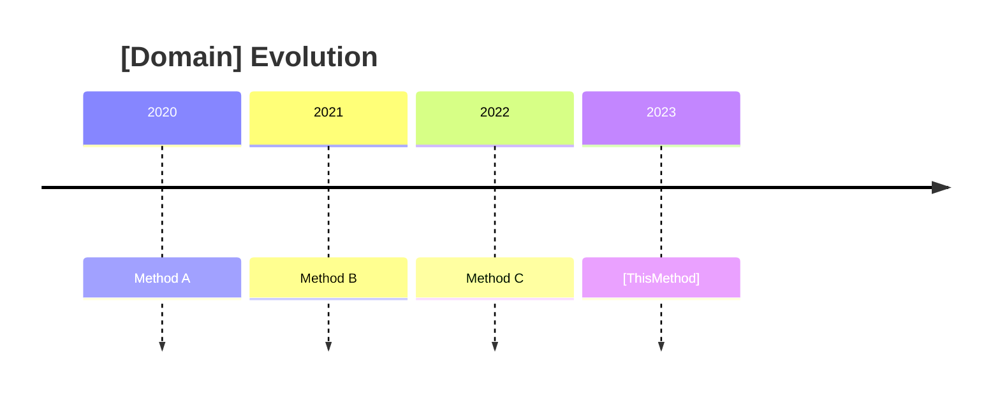

# 🎓 AI IDE Repository Analysis Prompt Template (v3.0 - Final)

<!-- Revision Log -->
<!-- v1.0: Initial complete draft -->
<!-- v2.0: Added anti-hallucination checks, structured self-correction -->
<!-- v3.0: Domain-specific templates, homework system, comparison framework -->

## 📋 Overview

This prompt guides an AI IDE to create a **comprehensive, accurate, and pedagogically sound** learning guide for deep learning repositories in:
- 🚗 Autonomous Driving (BEV perception, occupancy prediction, end-to-end planning)
- 🤖 Embodied AI (navigation, manipulation, world models)
- 🧠 Vision-Language-Action (VLA) models
- 🌍 World Models (video prediction, dynamics learning)
- 🎯 End-to-End Learning (sensor to action)

**Key Principle**: Every statement must be **verifiable from code**. No speculation, no hallucination.

---

## 🎯 Core Objectives

Create a **complete mastery guide** that enables a learner to:
1. ✅ Understand full architecture from inheritance to implementation
2. ✅ Master core algorithms with mathematical rigor
3. ✅ Trace data flow through entire pipeline with concrete shapes
4. ✅ Debug and optimize code effectively
5. ✅ Compare with related methods (横向对比)
6. ✅ Understand evolution within project (纵向对比)

**Target completion time**: 4-6 hours of focused study

**Critical Rule**: 🚨 **CODE IS TRUTH** 🚨
- Every claim must cite file path + line numbers
- Every shape must be verified with concrete examples
- Every "feature" must have code evidence
- If uncertain, explicitly mark as "需要验证" and investigate

---

## 📚 Required Document Structure

### File Organization

Create structured documentation in: `testwl/` directory

```
testwl/
├── [ProjectName]_Complete_Mastery_Guide.md    # Main learning guide
├── Algorithm_Comparison.md                     # 横向对比: vs other methods
├── Version_Evolution.md                        # 纵向对比: V1→V2→V3 changes
├── Quick_Reference.md                          # API reference, key configs
├── FAQ_and_Pitfalls.md                        # Common issues & solutions
└── Self_Assessment.md                         # 课后作业 with answers
```

### Main Guide Structure

```markdown
# [ProjectName] Complete Mastery Guide

## ✨ Document Status
- Total Chapters: 0-5
- Total Lines: ~XXXX
- Completion: [percentage]
- Last Updated: [date]

## 📖 How to Use This Guide
1. Study chapters sequentially (don't skip!)
2. Complete self-check questions after each chapter
3. Trace code while reading (don't just read passively)
4. Do homework in Self_Assessment.md
5. Refer to Quick_Reference.md when coding

## Chapter 0: Architecture Foundation (⏱️ 60 min) ⭐⭐⭐
### 0.1 Inheritance Chain Complete Analysis
- Full 7-layer (or N-layer) hierarchy
- File paths + exact line numbers for each class
- What each layer ADDS (with code evidence)
- Why each layer EXISTS (design rationale)
- Verification: Can you draw the tree from memory?

### 0.2 Design Philosophy
- Core principles (e.g., "BEV representation", "temporal fusion")
- Trade-offs made (accuracy vs speed, memory vs compute)
- Comparison with alternatives (why THIS design?)

## Chapter 1: Core Architecture Overview (⏱️ 40 min) ⭐⭐⭐⭐
### 1.1 System Architecture Diagram
- Mermaid diagram: Input → Modules → Output
- Component responsibilities clearly marked
- File locations for each component

### 1.2 Complete Data Flow
- Input format and shapes
- Transformation at each module (with shapes)
- Output format and interpretation
- Training vs Inference differences

### 1.3 Key Shape Transformations Table
```
Module           | Input Shape        | Output Shape       | File:Line
-----------------|--------------------|--------------------|----------
Backbone         | (B,N,3,H,W)       | (B,N,C,H',W')     | xxx.py:123
...
```

## Chapter 2: Algorithm Deep Dive (⏱️ 120-180 min) ⭐⭐⭐⭐⭐
### Template for Each Algorithm Section:

#### 2.X [Algorithm Name] (⏱️ XX min)

**Context**: Where does this fit in the pipeline?

**Problem**: What problem does this solve?

**Solution Approach**: High-level idea

**Mathematical Formulation**:
- Formal problem definition
- Key equations (LaTeX-style)
- Coordinate systems (if applicable)
- Transformation matrices

**Code Implementation**:
```python
# File: path/to/file.py
# Lines: XXX-YYY
# 完整代码展示
```

**Line-by-Line Walkthrough**:
- L_XXX: What happens (with shape changes)
- L_YYY: Why this operation
- ...

**Numerical Example**:
```
Given: B=2, N=6, H=128, W=352, ...
Step 1: input (2,6,3,128,352) → ...
Step 2: after backbone (2,6,256,32,88) → ...
...
```

**Visualization**:
- Mermaid/ASCII diagrams
- Before/after illustrations

**Common Pitfalls**:
- ⚠️ Pitfall 1: [description]
  - Wrong: [code]
  - Right: [code]
  - Why: [explanation]

**Self-Check**:
- [ ] Can you explain the math without looking?
- [ ] Can you trace the code execution?
- [ ] Can you calculate shapes manually?

## Chapter 3: Model Components (⏱️ 80 min) ⭐⭐⭐⭐
### 3.1 Head/Decoder Architecture
### 3.2 Loss Functions
- Mathematical formula + intuition
- Code implementation (file:line)
- Weighting strategy
- Expected value ranges during training
- Convergence behavior

### 3.3 Configuration Deep Dive
[Parameter table as specified below]

### 3.4 Version Comparison
[V1 vs V2 comparison table]

## Chapter 4: Data Pipeline (⏱️ 40 min) ⭐⭐⭐
### 4.1 Dataset Structure
### 4.2 Data Loading Pipeline
### 4.3 Augmentation Techniques
### 4.4 Configuration File Anatomy

## Chapter 5: Practical Mastery (⏱️ 30 min) ⭐⭐
### 5.1 Training Workflow
### 5.2 Debugging Checklist
### 5.3 Performance Optimization
### 5.4 Common Errors & Solutions
```

---

## 🔍 Analysis Requirements

### 1. **Inheritance Chain Analysis**

For every class in the core pipeline:
- Full inheritance hierarchy (base → derived)
- File path and exact line numbers
- What each layer adds (innovation/feature)
- Why this layer exists (design rationale)
- Code snippets proving the inheritance

**Format**:
```
Layer N: ClassName
├─ File: path/to/file.py
├─ Lines: XXX-YYY
├─ Inherits: ParentClass
├─ Adds: [specific feature]
└─ Why: [design reason]
```

### 2. **Algorithm Explanation Standard**

For each core algorithm:

**Mathematical Foundation**:
- Formal problem definition
- Mathematical formulation with LaTeX-style notation
- Coordinate system definitions (if applicable)
- Transformation matrices with explicit values

**Code Implementation**:
- File location and line numbers
- Function signature with type hints
- Line-by-line walkthrough
- Variable shape tracking (B, C, H, W, etc.)
- Intermediate results with example values

**Numerical Example**:
- Pick concrete dimensions (e.g., B=2, N=6, H=128, W=352)
- Trace through with actual numbers
- Show shapes at every step
- Highlight non-obvious transformations

**Visualization**:
- Mermaid diagrams for flow
- ASCII art for 3D concepts
- Tables for comparisons
- Before/after examples

### 3. **Coordinate Systems (if applicable)**

For vision/robotics projects, explicitly define:
- All coordinate systems used
- Origin, axes, units for each
- Transformation matrices between systems
- Code showing transformations
- Common mistakes in coordinate handling

### 4. **Data Flow Tracking**

Create a complete trace:
```
Input → Module1 → Module2 → ... → Output
(shape) (shape)   (shape)         (shape)
```

With:
- Tensor shapes at each stage
- Data type (float32, int64, etc.)
- Device (CPU/GPU)
- Memory layout (contiguous, etc.)

### 5. **Configuration Deep Dive**

For every config parameter:
- Parameter name
- Default value
- Value range
- Impact on model behavior
- When to tune it
- Interaction with other parameters

**Use tables**:
```markdown
| Parameter | Default | Range | Impact | Tuning |
|-----------|---------|-------|--------|--------|
| ...       | ...     | ...   | ...    | ...    |
```

### 6. **Loss Functions**

For each loss:
- Mathematical formula
- Why this loss (intuition)
- Code implementation
- Weighting strategy
- Expected value ranges
- Convergence behavior

### 7. **Version Comparisons**

When multiple versions exist (V1, V2, different backbones):
- Side-by-side comparison table
- What changed and why
- Performance differences
- Use case recommendations

---

## ✅ Self-Verification Protocol (MANDATORY)

🚨 **Anti-Hallucination Enforcement** 🚨

### Phase 1: Accuracy Verification (Run FIRST)

**For every claim, ask yourself**:
1. ❓ "Where is the code evidence?" → Cite file:line
2. ❓ "Did I actually read this code?" → Re-check if uncertain
3. ❓ "Are these shapes correct?" → Manually calculate
4. ❓ "Does this exist in THIS repo?" → Don't assume from other repos

**Specific Checks**:
- [ ] Every class name: Grep codebase to verify existence
- [ ] Every file path: Verify file exists at that path
- [ ] Every line number: Check line numbers are current
- [ ] Every shape: Trace through with concrete dimensions
- [ ] Every "feature": Find code that implements it
- [ ] Every comparison: Both sides verified from code

**Red Flags** (means you're likely hallucinating):
- "Probably...", "Likely...", "Seems to..."
- Describing features without code citations
- Generic statements that could apply to any repo
- Shapes that don't match dimensionality

**Fix**: If you catch yourself, immediately:
1. Mark section with `⚠️ 需要验证`
2. Search codebase for evidence
3. If found: Update with citations
4. If not found: Remove the claim

### Phase 2: Content Completeness
- [ ] All core classes in inheritance chain analyzed
- [ ] Every algorithm has: math + code + numerical example
- [ ] All coordinate systems defined (for vision/robotics)
- [ ] Complete data flow traced with shapes
- [ ] All config parameters documented in tables
- [ ] All loss functions: formula + code + ranges
- [ ] Version differences compared (V1 vs V2)
- [ ] External paper analysis requested if needed

### Phase 3: Pedagogical Quality
- [ ] Progressive difficulty (no forward references)
- [ ] Every section: time estimate + difficulty (⭐)
- [ ] "Teacher persona" explains WHY not just WHAT
- [ ] Self-check questions after major sections
- [ ] Memory aids for complex concepts
- [ ] Analogies for abstract ideas
- [ ] Common mistakes highlighted

### Phase 4: Numerical Verification
- [ ] Every example uses concrete numbers (B=2, H=128, etc.)
- [ ] Shapes verified at every transformation
- [ ] Matrix multiplication dimensions compatible
- [ ] Index ranges make sense (0-based, bounds)
- [ ] Example values realistic (no 1e10 for image dims)

### Phase 5: Cross-Consistency
- [ ] No contradictions between chapters
- [ ] Same terminology used throughout
- [ ] Cross-references point to correct sections
- [ ] Code snippets consistent with full code
- [ ] Shapes consistent across all mentions

### Phase 6: Completeness of Deliverables
- [ ] Main guide: [ProjectName]_Complete_Mastery_Guide.md
- [ ] Comparison: Algorithm_Comparison.md (vs related work)
- [ ] Evolution: Version_Evolution.md (if multiple versions)
- [ ] Reference: Quick_Reference.md
- [ ] Practice: Self_Assessment.md with answers

---

## 🎨 Writing Style Guidelines

### Tone: Friendly Expert Teacher

- Use "Lyric导师说" or similar teaching persona
- Explain WHY before WHAT
- Anticipate confusion points
- Provide memory aids and analogies

### Code Presentation

Always include:
```python
# File: path/to/file.py
# Lines: XXX-YYY
# Purpose: [one-line description]

def function_name(...):
    """
    Clear explanation of what this does
    
    Args:
        arg1: (shape) - description
        arg2: (shape) - description
    
    Returns:
        output: (shape) - description
    """
    # Line-by-line explanation as comments
    step1 = ...  # (shape): what happens here
    step2 = ...  # (shape): next transformation
    return result  # (final_shape)
```

### Visual Elements

Use liberally:
- ✅ ❌ for implemented/not implemented
- 🎯 🔍 📊 🎨 for section markers
- Tables for comparisons
- Mermaid diagrams for architecture
- ASCII art for 3D/spatial concepts
- Progress indicators (⏱️ time, ⭐ difficulty)

---

## 📝 Self-Check Questions

At the end of each major section, include:

```markdown
### ✅ Self-Check Questions

After studying this section, can you:
- [ ] Question 1 testing core concept
- [ ] Question 2 testing implementation detail
- [ ] Question 3 testing mathematical understanding
- [ ] Question 4 testing debugging ability
- [ ] Question 5 testing design rationale

**Answers**:
Provide hints or full answers at document end.
```

---

## 🔧 Common Pitfalls Section

For each algorithm/module, document:
- Common mistakes in understanding
- Implementation bugs you found
- Confusing variable names
- Non-obvious design choices
- Edge cases

---

## 📖 External Documentation Handling

**IMPORTANT**: When you need PDF algorithm papers analyzed:

1. **Stop and request**:
```markdown
⚠️ **PDF Analysis Required**

I need the following paper(s) analyzed to complete this guide:
- Paper name: [title]
- Focus areas: [specific sections/algorithms]
- Key information needed: [what to extract]

Please use an external AI tool to:
1. Extract the paper content as text
2. Summarize the algorithm sections: [list sections]
3. Extract mathematical formulations
4. Note any differences from the code implementation

Paste the extracted content here: [placeholder]
```

2. **Continue after receiving**:
- Compare paper vs code implementation
- Note divergences
- Explain engineering modifications

---

## 🎯 Final Deliverable Checklist

Before declaring the guide complete:

### Structure
- [ ] All chapters present (0-5)
- [ ] Estimated times sum to 4-6 hours
- [ ] Progressive difficulty curve
- [ ] No circular dependencies in explanations

### Content Quality
- [ ] Every core algorithm fully explained
- [ ] All inheritance chains traced
- [ ] Complete data flow documented
- [ ] All configs explained
- [ ] Debugging section included

### Pedagogical Elements
- [ ] Time estimates for each section
- [ ] Difficulty ratings
- [ ] Self-check questions
- [ ] "Teacher persona" explanations
- [ ] Memory aids and summaries

### Technical Accuracy
- [ ] Code paths verified
- [ ] Line numbers accurate
- [ ] Shapes mathematically consistent
- [ ] No contradictions

### Usability
- [ ] Table of contents with links
- [ ] Progress tracking
- [ ] Quick reference tables
- [ ] Troubleshooting guide

---

## 🔄 Iterative Improvement Protocol (3-Round Minimum)

### Round 1: Complete First Draft
**Goal**: Get all content down
- Write all chapters 0-5
- Include code citations (even if rough)
- Add at least one numerical example per algorithm
- Create basic diagrams

**Self-Check**: "Is anything missing from the template?"

### Round 2: Accuracy & Anti-Hallucination Sweep
**Goal**: Eliminate all unverified claims
- Re-read EVERY code citation, verify line numbers
- Re-calculate EVERY shape transformation
- Search codebase for EVERY claimed feature
- Mark or remove anything uncertain
- Add `⚠️ 已验证` tags to verified claims

**Self-Check**: "Can I defend every statement with code?"

**Common fixes needed**:
- ❌ "This module does X" → ✅ "This module does X (file.py:123)"
- ❌ Vague shapes → ✅ Concrete dimensions with trace
- ❌ "Probably uses..." → ✅ Verified or removed
- ❌ Generic descriptions → ✅ Repo-specific details

### Round 3: Pedagogical Enhancement
**Goal**: Make it truly learnable
- Add more "Teacher persona" explanations
- Insert self-check questions where missing
- Improve diagrams for clarity
- Add more numerical examples for complex parts
- Create better memory aids
- Write FAQ_and_Pitfalls.md
- Complete Self_Assessment.md homework

**Self-Check**: "Could a student master this in 4-6 hours?"

### Round 4 (Optional): Comparison & Context
**Goal**: Enable横向纵向对比
- Complete Algorithm_Comparison.md
  - Compare with 2-3 related methods
  - Highlight key differences
  - Pros/cons table
- Complete Version_Evolution.md (if applicable)
  - What changed V1→V2→V3
  - Why each change
  - Migration guide

### Version Marking
```markdown
<!-- Revision Log -->
<!-- v0.1: Initial draft, all chapters present -->
<!-- v0.2: Accuracy sweep, verified all code citations -->
<!-- v0.3: Pedagogical enhancement, added self-checks -->
<!-- v1.0: Complete with comparison docs -->
<!-- v1.1: Fixed [specific user-reported issues] -->
```

### Continuous Self-Correction

As you write, constantly ask:
1. **Is this verifiable?** If no → add citation or remove
2. **Is this repo-specific?** If no → make it specific
3. **Is this clear to a learner?** If no → add explanation
4. **Is this accurate?** If unsure → verify or mark

When you catch an error:
1. ✅ Immediately fix it
2. ✅ Check if same error exists elsewhere
3. ✅ Add to FAQ_and_Pitfalls.md
4. ✅ Add self-check question to prevent misunderstanding

---

## 📊 Progress Tracking Template

Include at document start:

```markdown
## ✅ Learning Progress Tracker

### Chapters Completed
- [ ] Chapter 0: Architecture Foundation
- [ ] Chapter 1: Core Overview
- [ ] Chapter 2: Algorithms Deep Dive
- [ ] Chapter 3: Model Components
- [ ] Chapter 4: Data Pipeline
- [ ] Chapter 5: Practical Implementation

### Skills Mastered
- [ ] Can explain full inheritance chain
- [ ] Can trace data flow end-to-end
- [ ] Can debug model issues
- [ ] Can modify configurations
- [ ] Can optimize performance
- [ ] Can extend to new tasks

### Time Spent: ____ / 6 hours
```

---

## 🚀 Start Command

When beginning analysis of a new repository, use:

```
Please create a complete mastery guide for this repository following the 
IDE_prompt.md template. Focus on:

1. Domain: [autonomous driving / embodied AI / VLA / world model / etc.]
2. Core algorithms: [list key algorithms if known]
3. Target learning time: 4-6 hours
4. Depth level: Implementation-ready understanding

Start with Chapter 0: Complete inheritance chain analysis.  
```

---

## 🎯 Domain-Specific Analysis Templates

### For Autonomous Driving (BEV, Occupancy, Detection)

**Must Include**:
1. **Coordinate Systems** (always 4-6 systems):
   - Image, Camera, Ego, Global, BEV Grid, Voxel
   - Origin, axes, units for each
   - Transformation matrices with concrete examples
   - Common coordinate bugs and fixes

2. **Multi-Camera Fusion**:
   - How many cameras? Layout diagram
   - Fusion strategy (early/mid/late)
   - Overlap handling (if any)
   - Code showing fusion: file:line

3. **Temporal Modeling** (if 4D/video):
   - How many frames? (current + history)
   - Alignment mechanism (optical flow, ego motion, etc.)
   - Temporal fusion architecture
   - Memory: how is history stored?

4. **Depth Estimation** (if applicable):
   - Depth representation (bins, continuous, stereo)
   - Supervision source (LiDAR, stereo, self-supervised)
   - Depth range and discretization

5. **BEV Representation** (if applicable):
   - Grid size (X, Y, Z ranges)
   - Resolution (meters per pixel)
   - How 2D image → 3D/BEV (LSS, OFT, transformer)
   - Pillar/voxel/point representation

6. **Metrics**:
   - mAP, mIoU, NDS, etc.
   - Per-class performance
   - Speed (FPS, latency)

**Comparison Table Template**:
```markdown
| Method | BEV Method | Temporal | Depth | mIoU | FPS |
|--------|------------|----------|-------|------|-----|
| This   | ...        | ...      | ...   | ...  | ... |
| BEVDet | LSS        | ✗       | ✗    | 32   | 10  |
| ...
```

### For Embodied AI (Navigation, Manipulation)

**Must Include**:
1. **Action Space**:
   - Discrete or continuous?
   - Dimensions and ranges
   - Action representation

2. **Observation Space**:
   - Sensor modalities (RGB, depth, tactile, etc.)
   - Sensor fusion approach
   - Observation encoding

3. **Policy Architecture**:
   - Input → Policy → Output flow
   - Recurrent components (if any)
   - Attention mechanisms

4. **Training Paradigm**:
   - RL, BC, IL, or hybrid?
   - Reward function (if RL)
   - Dataset (if IL/BC)

5. **Sim2Real** (if applicable):
   - Simulation environment
   - Domain randomization
   - Real-world deployment details

### For VLA (Vision-Language-Action)

**Must Include**:
1. **Multi-Modal Fusion**:
   - Vision encoder (ViT, CNN, etc.)
   - Language encoder (BERT, T5, etc.)
   - Fusion mechanism (cross-attention, concat, etc.)
   - Code showing fusion: file:line

2. **Instruction Following**:
   - Instruction format/template
   - How instructions condition actions
   - Grounding mechanism (language → vision)

3. **Action Decoding**:
   - From joint embedding → action tokens
   - Autoregressive or parallel
   - Action tokenization scheme

4. **Training Data**:
   - Dataset scale and diversity
   - (Instruction, Observation, Action) tuples
   - Data augmentation

### For World Models (Video Prediction, Dynamics)

**Must Include**:
1. **State Representation**:
   - Latent space architecture
   - Deterministic vs stochastic
   - Dimensionality

2. **Dynamics Model**:
   - Recurrent (RNN, SSM) or transformer?
   - How actions condition next state
   - Rollout length during training/inference

3. **Reconstruction**:
   - Decoder architecture
   - Reconstruction loss
   - Quality metrics (PSNR, SSIM, etc.)

4. **Planning** (if applicable):
   - How model used for planning
   - MPC, shooting, etc.
   - Planning horizon

### For End-to-End Learning

**Must Include**:
1. **Input Modalities**:
   - Sensors used (camera, LiDAR, radar, etc.)
   - Preprocessing pipeline
   - Multi-modal fusion (if any)

2. **Output Space**:
   - Control commands (steering, throttle, etc.)
   - Waypoints/trajectory
   - High-level decisions

3. **Architecture**:
   - Backbone (CNN, transformer, etc.)
   - Intermediate representations (if any)
   - Output heads

4. **Training**:
   - Imitation learning vs RL
   - Dataset (human demos, simulation, etc.)
   - Losses and their weights

5. **Safety**:
   - Collision avoidance mechanism
   - Intervention handling
   - Failure modes

---

## 📝 Homework System (Self_Assessment.md)

### Structure Template

```markdown
# Self-Assessment: [ProjectName] Mastery Test

## Instructions
- Complete after reading main guide
- Don't look at answers until you've tried
- Passing score: 80% (24/30 questions)
- Time limit: 90 minutes

## Part 1: Architecture (10 questions)

### Q1. Inheritance Chain (难度: ⭐)
Draw the complete inheritance chain. List what each layer adds.

**Your Answer**:
```
[Space for answer]
```

### Q2. Data Flow (难度: ⭐⭐)
Trace data flow from input to output with shapes.

**Your Answer**:
```
[Space for answer]
```

[... 8 more architecture questions]

## Part 2: Algorithm Understanding (10 questions)

### Q11. Mathematical Derivation (难度: ⭐⭐⭐)
[Problem statement]

**Your Answer**:
```
[Space]
```

[... 9 more algorithm questions]

## Part 3: Implementation Skills (10 questions)

### Q21. Debugging (难度: ⭐⭐⭐)
[Debugging scenario]

**Your Answer**:
```
[Space]
```

[... 9 more implementation questions]

---

## Answer Key

<details>
<summary>Click to reveal (only after attempting!)</summary>

### A1. Inheritance Chain
```
[Complete answer with file:line]
```

[... all answers with explanations]

</details>
```

### Question Design Principles
1. **Progressive Difficulty**: ⭐ (recall) → ⭐⭐⭐⭐⭐ (synthesis)
2. **Cover All Chapters**: ~3 questions per chapter
3. **Mix Types**: Recall, Understanding, Application, Analysis
4. **Verifiable**: Objective answers from code
5. **Practical**: Real scenarios you'd face

---

## 🔍 Comparison Framework (Algorithm_Comparison.md)

### Template

```markdown
# Algorithm Comparison: [ThisMethod] vs Related Work

## Methods Compared

1. **[ThisMethod]** (this repo)
2. **[Related1]** - [description]
3. **[Related2]** - [description]
4. **[Related3]** - [description]

## High-Level Comparison

| Aspect | [This] | [R1] | [R2] | [R3] |
|--------|--------|------|------|------|
| **Core Idea** | ... | ... | ... | ... |
| **Innovation** | ... | ... | ... | ... |
| **Performance** | ... | ... | ... | ... |
| **Speed** | ... | ... | ... | ... |

## Detailed Technical Comparison

### 1. [Aspect, e.g., "BEV Extraction"]

**[ThisMethod]**:
- Method: [e.g., LSS]
- Code: [file:line]
- Pros: ...
- Cons: ...

**[Related1]**:
- Method: [e.g., Transformer]
- Key Difference: ...
- Pros/Cons: ...

**📈 Performance**:
```
Method    | mIoU | FPS
[This]    | XX.X | XX
[Related1]| XX.X | XX
```

**🧠 When to Use**:
- Use [This] if: ...
- Use [Related1] if: ...

### 2. [Another Aspect]

[Repeat structure]

## Evolution Timeline



## Key Insights

### What [This] Does Better
1. **[Aspect]**: [evidence]

### What [This] Trades Off
1. **[Aspect]**: [explanation]

### Lessons for Future Work
- ...

## References
- [This]: [link]
- [Related1]: [link]
```

### Selection Criteria

Choose 2-4 related methods:
1. **Directly comparable**: Same task
2. **Representative**: Different approaches
3. **Recent**: Within 2-3 years
4. **Well-known**: Highly cited

---

**END OF PROMPT v3.0 - FINAL**
