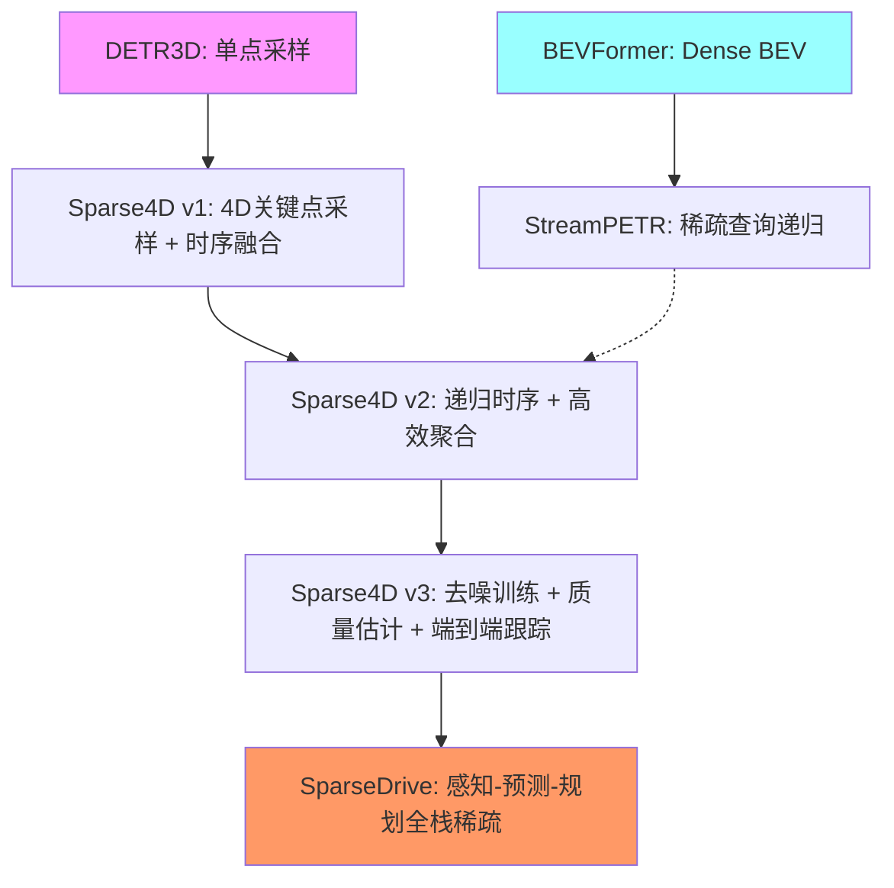
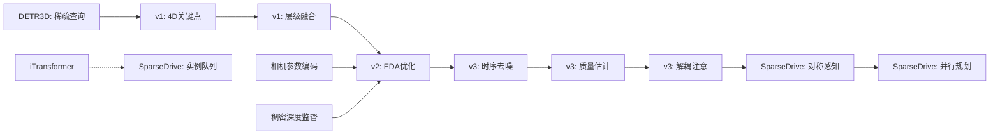

# Sparse4D 算法家族完全技术解析与自动驾驶感知体系演进

## 目录
1. [算法家族总览与核心哲学](#1-算法家族总览与核心哲学)
2. [Sparse4D v1：稀疏时空融合奠基之作](#2-sparse4d-v1稀疏时空融合奠基之作)
3. [Sparse4D v2：递归时序融合的效率革命](#3-sparse4d-v2递归时序融合的效率革命)
4. [Sparse4D v3：端到端检测与跟踪的统一](#4-sparse4d-v3端到端检测与跟踪的统一)
5. [SparseDrive：稀疏场景表征的端到端驾驶](#5-sparsedrive稀疏场景表征的端到端驾驶)
6. [竞争算法全景对比](#6-竞争算法全景对比)
7. [性能演进与实测数据](#7-性能演进与实测数据)
8. [工程实现细节汇编](#8-工程实现细节汇编)
9. [技术路线图谱与未来展望](#9-技术路线图谱与未来展望)

---

## 1. 算法家族总览与核心哲学

### 1.1 稀疏表征范式 vs BEV范式的根本分歧

| 对比维度 | 稀疏表征范式 (Sparse4D系列) | BEV范式 (BEVFormer等) |
|---------|---------------------------|---------------------|
| **计算复杂度** | 检测头计算量与图像分辨率/感知距离无关 | 与BEV特征图尺寸呈平方关系，随距离增加而爆炸 |
| **视图转换** | 无需显式转换，通过3D锚点投影直接采样 | 需要复杂的Lift-Splat或Attention-based转换 |
| **内存占用** | O(M) M为锚点数量，通常900-1000 | O(H×W) H,W为BEV网格，通常200×200=40K |
| **时序融合** | 实例特征递归传播，O(1)复杂度 | 多帧特征缓存与对齐，O(T)复杂度 |
| **部署友好性** | 极高，适合边缘计算设备 | 受限于 dense feature 操作，部署困难 |
| **高度信息保留** | 完整保留3D空间结构 | BEV压缩高度维度，丢失纹理 |
| **下游任务扩展** | 实例特征天然适合图神经网络 | 需要额外设计实例提取模块 |

**核心哲学**：Sparse4D家族坚信，自动驾驶感知不应被稠密的规则网格束缚。真实驾驶场景由稀疏的动态 agents（车辆、行人）和静态元素（车道线、路沿）构成，应该用稀疏的实例来表征，而非将整个空间离散化为稠密网格。

### 1.2 四代算法演进脉络



---

## 2. Sparse4D v1：稀疏时空融合奠基之作

### 2.1 核心动机与贡献

**论文信息**：arXiv:2211.10581v2 (2023年2月10日)

**四大核心贡献**：
1. **首个时序融合稀疏多视角3D检测算法**：通过4D关键点实现时空特征对齐
2. **可变形4D聚合模块**：灵活完成多维度（点、时间戳、视角、尺度）特征采样与融合
3. **深度重加权模块**：显式估计深度分布，缓解3D到2D投影的病态问题
4. **SOTA性能**：nuScenes上超越所有稀疏算法和多数BEV算法

### 2.2 整体架构

```
多视角图像
    ↓
图像编码器 (Backbone + FPN)
    ↓
多尺度特征图 I_t = {I_t,n,s | 1≤s≤S, 1≤n≤N}
    ↓
时序特征队列 I = {I_t} (T帧)
    ↓
解码器 (6个级联优化模块)
    ↓
3D锚框 B ∈ ℝ^(M×11) + 实例特征 F ∈ ℝ^(M×C)
    ↓
分类头 → 检测结果
```

**锚框表示**：B = {x, y, z, ln w, ln h, ln l, sin yaw, cos yaw, vx, vy, vz}

### 2.3 可变形4D聚合模块 (Deformable 4D Aggregation)

#### 2.3.1 4D关键点生成

对于第m个锚框实例，分配K个4D关键点 P_m ∈ ℝ^(K×T×3)：
- **固定关键点** K_F=7：锚框中心 + 6个面中心
- **可学习关键点** K_L=6：由子网络Φ动态生成

**可学习关键点生成公式**：
```math
D_m = R_{yaw}·[sigmoid(Φ(F_m)) - 0.5] ∈ ℝ^(K_L×3) \\
P^L_{m,t0} = D_m × [w_m, h_m, l_m] + [x_m, y_m, z_m]
```

**时序扩展**（关键创新）：
```math
P'_{m,t} = P_{m,t0} - d_t·(t0-t)·[vx_m, vy_m, vz_m] \\
P_{m,t} = R_{t0→t}·P'_{m,t} + T_{t0→t}
```

#### 2.3.2 稀疏采样

投影到多视角特征图：
```math
P^{img}_{t,n} = T_{cam}^n · P_t \\
f_{m,k,t,n,s} = Bilinear(I_{t,n,s}, P^{img}_{m,k,t,n})
```

得到特征张量：f_m ∈ ℝ^(K×T×N×S×C)

#### 2.3.3 层级融合

**三阶段融合策略**：
1. **视角/尺度融合**：每组通道G使用不同权重
```math
W_m = Ψ(F_m) ∈ ℝ^(K×N×S×G) \\
f'_{m,k,t,i} = Σ_{n=1}^N Σ_{s=1}^S W_{m,k,n,s,i}·f_{m,k,t,n,s,i}
```

2. **时序融合**：序列线性层递归融合
```math
f''_{m,k,ts} = f'_{m,k,ts} \\
f''_{m,k,t} = Ψ_{temp}([f'_{m,k,t}, f''_{m,k,t-1}])
```

3. **关键点融合**：求和聚合
```math
F'_m = Σ_{k=1}^K f''_{m,k}
```

### 2.4 深度重加权模块 (Depth Reweight Module)

**问题根源**：3D→2D投影存在歧义，不同深度的3D点可能投影到相同2D坐标，导致特征混淆。

**解决方案**：
```math
C_m = Bilinear(Ψ_{depth}(F'_m), √(x^2_m + y^2_m)) \\
F''_m = C_m · F'_m
```

**训练方式**：使用标注框中心深度作为监督，无需LiDAR点云。

### 2.5 训练损失函数

```math
L = λ_1·L_{cls} + λ_2·L_{box} + λ_3·L_{depth}
```

- **分类损失**：Focal Loss
- **回归损失**：L1 Loss
- **深度损失**：二元交叉熵

### 2.6 实验结果

#### 2.6.1 nuScenes验证集对比

| 方法 | 时序 | Backbone | mAP↑ | NDS↑ | FPS |
|-----|------|----------|------|------|-----|
| DETR3D | × | ResNet101 | 0.349 | 0.434 | - |
| BEVFormer-S | × | ResNet101 | 0.375 | 0.448 | - |
| **Sparse4D (T=1)** | × | ResNet101 | **0.382** | **0.451** | 21.5 |
| BEVFormer | ✓ | ResNet101 | 0.416 | 0.517 | - |
| BEVDepth | ✓ | ResNet101 | 0.412 | 0.535 | - |
| **Sparse4D (T=4)** | ✓ | ResNet101 | **0.436** | **0.541** | 15.3 |

**关键发现**：T=4时，mAP提升5.4%，NDS提升9.0%，仅增加9.3%计算量和1.4%参数量。

#### 2.6.2 消融研究

| 模块 | mAP↑ | mAOE↓ | NDS↑ |
|-----|------|-------|------|
| 基线 | 0.432 | 0.408 | 0.533 |
| +深度重加权 | 0.431 → 0.436 | 0.381 → 0.363 | 0.537 → 0.541 |
| +可学习关键点 | 0.432 → 0.432 | 0.379 → 0.379 | 0.537 → 0.537 |
| **两者结合** | **0.436** | **0.363** | **0.541** |

**运动补偿分析**：
- 无时序：mAVE=0.890
- 仅 ego 运动补偿：mAVE=0.398 (↓55.3%)
- +物体运动补偿：mAVE=0.329 (↓17.3%)

---

## 3. Sparse4D v2：递归时序融合的效率革命

### 3.1 核心动机与改进

**论文信息**：arXiv:2305.14018v2 (2023年5月24日)

**v1的痛点**：多帧采样导致计算复杂度O(T)，推理速度随历史帧数线性下降，内存占用爆炸。

**v2的核心创新**：
1. **递归时序融合**：将复杂度从O(T)降至O(1)
2. **高效可变形聚合 (EDA)**：CUDA算子融合，训练内存降低51%，推理速度提升42%
3. **相机参数显式编码**：增强对相机配置变化的鲁棒性
4. **稠密深度监督**：早期训练稳定性提升

### 3.2 递归时序融合机制

```
Frame t-1: 实例 (A_{t-1}, F_{t-1})
    ↓  ego运动投影
Frame t:   A_t = Project(A_{t-1}), F_t = F_{t-1}
    ↓  锚框编码器 Ψ
          E_t = Ψ(A_t)
    ↓  时序交叉注意力
    当前帧实例与历史实例交互
```

**运动投影公式**：
```math
\begin{aligned}
[x,y,z]_t &= R_{t-1→t}([x,y,z]_{t-1} + d_t·[vx,vy,vz]_{t-1}) + T_{t-1→t} \\
[w,l,h]_t &= [w,l,h]_{t-1} \\
[cos yaw, sin yaw, 0]_t &= R_{t-1→t}[cos yaw, sin yaw, 0]_{t-1} \\
[vx,vy,vz]_t &= R_{t-1→t}[vx,vy,vz]_{t-1}
\end{aligned}
```

**架构优势**：
- **速度**：T=9时，v1 FPS=6.1，v2 FPS=19.4 (恒定时速)
- **内存**：v1 GPU内存=1149M，v2=432M (与T无关)

### 3.3 高效可变形聚合 (EDA)

**原始实现问题**：频繁HBM访问，大量中间变量，训练内存6328MB。

**CUDA算子融合**：将双线性采样+加权求和合并为单算子
- **并行度**：K维度×C维度完全并行
- **单线程复杂度**：N×S → 2S (多视角最多2个视锥重叠)
- **效果**：训练内存→3100MB (-51%)，推理FPS→20.3 (+48%)

### 3.4 相机参数显式编码

**v1隐式问题**：全连接层权重隐含相机参数，无法应对：
- 图像输入顺序变化
- 大规模相机参数数据增强

**v2解决方案**：
```math
T_{output→img} \xrightarrow{MLP} \text{高维特征} \xrightarrow{Add} \text{实例特征}
```

**效果**：移除该模块导致mAP↓2.0，mAOE↑4.8。

### 3.5 稠密深度监督

**监督策略**：LiDAR点云投影到多尺度特征图，1×1卷积输出深度值。

**损失函数**：L1损失，推理时不激活。

**效果**：移除后mAP↓8.5，NDS↓10.4，训练出现梯度崩溃。

### 3.6 实验结果

#### 3.6.1 nuScenes验证集

| 方法 | Backbone | Image Size | mAP↑ | NDS↑ | FPS↑ |
|-----|----------|------------|------|------|------|
| BEVPoolv2 | ResNet50 | 256×704 | 0.406 | 0.526 | 16.6 |
| SOLOFusion | ResNet50 | 256×704 | 0.427 | 0.534 | 11.4 |
| StreamPETR | ResNet50 | 256×704 | 0.432 | 0.537 | 26.7 |
| **Sparse4Dv2** | **ResNet50** | **256×704** | **0.439** | **0.539** | **20.3** |

| **Sparse4Dv2†** | **ResNet101** | **512×1408** | **0.505** | **0.594** | **8.4** |

**†**：使用nuImage预训练权重

#### 3.6.2 消融实验

| Exp | 时序解码器 | 单帧层 | 相机编码 | 深度监督 | mAP | NDS |
|-----|------------|--------|----------|----------|-----|-----|
| 1 | ✗ | ✗ | ✓ | ✓ | 0.341 | 0.414 |
| 2 | ✓ | ✗ | ✗ | ✓ | 0.384 | 0.504 |
| 3 | ✗ | ✓ | ✗ | ✓ | 0.419 | 0.524 |
| 4 | ✓ | ✓ | ✓ | ✗ | 0.354 | 0.435 |
| **5** | **✓** | **✓** | **✓** | **✓** | **0.439** | **0.539** |

**时序融合贡献**：+9.8 mAP，+12.5 NDS

---

## 4. Sparse4D v3：端到端检测与跟踪的统一

### 4.1 核心动机与贡献

**论文信息**：arXiv:2311.11722v1 (2023年11月20日)

**v2遗留问题**：
- 稀疏算法收敛比稠密算法困难（one-to-one匹配不稳定）
- 分类置信度无法反映定位质量
- 跟踪仍需后处理

**v3三大创新**：
1. **时序实例去噪**：将2D去噪扩展到3D时序，稳定正样本匹配
2. **质量估计**：centerness + yawness，优化预测排序
3. **解耦注意力**：消除anchor embedding与instance feature的干扰
4. **端到端跟踪**：无需修改训练，直接输出轨迹ID

### 4.2 时序实例去噪 (Temporal Instance Denoising)

**核心思想**：将GT加噪作为查询输入，提供稳定正样本。

**锚框生成**：
```math
A_{gt} = \{(x,y,z,w,l,h,yaw,v_{xyz})_i | i∈[1,N]\} \\
A_{noise} = \{A_i + ΔA_{i,j,k} | i∈[1,N], j∈[1,M], k∈[1,2]\}
```

**噪声设计**：
- ΔA_{i,j,1} ~ Uniform(-x, x)  **正样本**
- ΔA_{i,j,2} ~ Uniform(-2x, -x) ∪ Uniform(x, 2x) **负样本**

**时序传播**：随机选M'组噪声实例投影到下一帧，特征直接传递。

**注意力隔离**：不同组实例间无特征交互，避免匹配歧义。

**效果**：单帧去噪 +0.8 mAP，时序去噪 +0.4 mAP。

### 4.3 质量估计 (Quality Estimation)

**问题**：分类置信度无法反映定位质量差异。

**两种质量度量**：
```math
C = exp(-\|[x,y,z]_{pred} - [x,y,z]_{gt}\|^2) \quad \text{(Centerness)} \\
Y = [sin yaw, cos yaw]_{pred} · [sin yaw, cos yaw]_{gt} \quad \text{(Yawness)}
```

**损失函数**：
```math
L = λ_1·CE(Y_{pred}, Y) + λ_2·Focal(C_{pred}, C)
```

**效果**：Centerness↓mATE 1.8%，Yawness缓解方向估计退化，组合↓mAVE 1.9%。

### 4.4 解耦注意力 (Decoupled Attention)

**问题**：Vanilla Attention中anchor embedding + instance feature导致注意力权重异常（图3）。

**解决方案**：拼接替代相加
```math
\text{Query} = Concat(E_1, E_2, E_3, E_4, F) \\
\text{Key} = Concat(E_1, E_2, E_3, E_4, F) \\
\text{Value} = F
```

**与Conditional DETR区别**：
- 改进的是**实例间自注意力**而非跨图像注意力
- 在**多头注意力外部**拼接，提供更大灵活性

**效果**：+1.1 mAP，+1.9 mAVE。

### 4.5 端到端跟踪 (End-to-End Tracking)

**极简实现**：直接在检测结果上分配ID，无需修改训练。

**算法流程**：
```python
if confidence > T_thresh and (no ID or new target):
    assign new ID
elif confidence > T_thresh and has ID:
    maintain ID
else:
    ID remains empty
```

**优势**：无需跟踪约束、无需GT ID、无需后处理。

**效果**：AMOTA 49.0% (val)，IDS↓44.5%。

### 4.6 实验结果

#### 4.6.1 nuScenes验证集

| 方法 | Backbone | mAP↑ | NDS↑ | AMOTA↑ | FPS |
|-----|----------|------|------|--------|-----|
| StreamPETR | ResNet50 | 0.432 | 0.537 | - | 26.7 |
| Sparse4Dv2 | ResNet50 | 0.439 | 0.539 | 0.414 | 20.3 |
| **Sparse4Dv3** | **ResNet50** | **0.469** | **0.561** | **0.490** | **19.8** |

| **Sparse4Dv3†** | **ResNet101** | **0.537** | **0.623** | **0.567** | **8.2** |

#### 4.6.2 消融实验

| 配置 | mAP↑ | mATE↓ | mAVE↓ | NDS↑ | AMOTA↑ |
|-----|------|-------|-------|------|--------|
| Sparse4Dv2 | 0.439 | 0.598 | 0.282 | 0.539 | 0.414 |
| +单帧去噪 | 0.447 | 0.586 | 0.257 | 0.548 | 0.445 |
| +解耦注意力 | 0.458 | 0.599 | 0.238 | 0.551 | 0.472 |
| +时序去噪 | 0.462 | 0.581 | 0.246 | 0.557 | 0.457 |
| +Centerness | 0.463 | 0.563 | 0.221 | 0.554 | 0.466 |
| +Yawness | **0.469** | **0.553** | **0.227** | **0.561** | **0.490** |

#### 4.6.3 未来帧与大型骨干网络

| 配置 | Future | mAP↑ | NDS↑ | AMOTA↑ | mAVE↓ |
|-----|--------|------|------|--------|-------|
| ResNet101 | 0 | 0.570 | 0.658 | 0.571 | 0.202 |
| ResNet101 | 8 | **0.613** | **0.690** | **0.608** | **0.144** |
| EVA02-Large | 0 | 0.630 | 0.694 | 0.643 | 0.184 |
| EVA02-Large | 8 | **0.668** | **0.719** | **0.677** | **0.142** |

**未来帧融合**：引入后续8帧，mAVE↓28.7%，NDS↑4.9%。

---

## 5. SparseDrive：稀疏场景表征的端到端驾驶

### 5.1 核心动机与范式突破

**论文信息**：arXiv:2405.19620v2 (2024年5月31日)

**对现有E2E方法的批判**：
1. **BEV特征计算昂贵**：限制边缘部署
2. **预测与规划任务设计简单**：忽略两者相似性
   - 都是多模态问题
   - 都需要语义+几何信息
   - 都是双向交互（自车影响他车）
3. **后处理破坏端到端**：碰撞避免依赖手工规则

**Sparse-Centric范式**：
- **对称稀疏感知**：检测/跟踪/建图统一架构
- **并行运动规划器**：预测与规划同时建模
- **层次化规划选择**：碰撞感知重打分确保安全

### 5.2 对称稀疏感知模块

```
多视角图像
    ↓
Image Encoder
    ↓
对称分支1: 动态物体检测/跟踪
  - 实例特征 F_d ∈ ℝ^(N_d×C)
  - 锚框 B_d ∈ ℝ^(N_d×11)
    ↓
  1个非时序Decoder + 5个时序Decoder
    ↓
  输出：检测框 + 轨迹ID

对称分支2: 静态地图Online Mapping
  - 实例特征 F_m ∈ ℝ^(N_m×C)
  - 锚线 L_m ∈ ℝ^(N_m×N_p×2)  # 多段线
    ↓
  相同架构Decoder
    ↓
  输出：矢量化地图元素
```

**跟踪策略**：置信度>0.2时分配ID，时序传播中保持不变（继承v3）。

### 5.3 并行运动规划器

#### 5.3.1 自车实例初始化

**问题**：自车在相机盲区，无法直接特征聚合。

**创新方案**：
```math
F_e = AveragePool(I_{front}, S)  # 使用前视最小特征图
```

**优势**：
1. 已编码场景语义上下文
2. 作为稀疏表征的补充，覆盖黑名单障碍物

**自车锚框 B_e**：位置/尺寸/朝向已知，速度用上帧预测值（避免GT泄露）。

#### 5.3.2 时空交互

**实例记忆队列**：(N_d+1)×H，存储H=3帧历史。

**三种交互**：
1. **Agent-时序交叉注意**：实例级交互（非场景级）
2. **Agent-自注意**： agents间高阶交互
3. **Agent-地图交叉注意**：场景几何约束

#### 5.3.3 层次化规划选择

**多模态轨迹生成**：
```math
τ_m ∈ ℝ^(N_d×K_m×T_m×2)  # 他车预测
τ_p ∈ ℝ^(N_cmd×K_p×T_p×2)  # 自车规划
```

**选择策略**：
1. **命令筛选**：根据高-level命令（左/右/直行）选轨迹子集
2. **碰撞感知重打分**：用预测结果评估碰撞风险，高风险轨迹分数置0
3. **最高分选择**：max score为最终规划

**与后优化对比**：
| 方法 | L2误差 | 碰撞率 |
|-----|--------|--------|
| UniAD原后优化 | 0.73m | 0.61% |
| SparseDrive无CAR | 0.61m | 0.12% |
| **SparseDrive+CAR** | **0.61m** | **0.08%** |

### 5.4 端到端学习策略

**两阶段训练**：
1. **Stage-1**：仅训练对称稀疏感知（100 epoch）
2. **Stage-2**：感知+规划联合训练（10 epoch），所有权重解冻

**损失函数**：
```math
L = L_{det} + L_{map} + L_{motion} + L_{plan} + L_{depth}
```

**规划损失**：Winner-takes-all + 自车状态回归

### 5.5 实验结果

#### 5.5.1 感知任务

| 任务 | SparseDrive-S | SparseDrive-B | UniAD† | 提升 |
|-----|---------------|---------------|--------|------|
| 检测mAP | 0.418 | **0.496** | 0.380 | +11.6% |
| 跟踪AMOTA | 0.386 | **0.501** | 0.359 | +14.2% |
| 建图mAP | 55.1 | **56.2** | 47.6 | +8.6% |

#### 5.5.2 预测与规划

| 方法 | minADE↓ | minFDE↓ | MR↓ | L2↓ | Col.%↓ |
|-----|---------|---------|-----|-----|--------|
| UniAD† | 0.71 | 1.02 | 15.1% | 0.73 | 0.61% |
| VAD† | 0.62 | 0.99 | 13.6% | 0.72 | 0.21% |
| **SparseDrive-S** | **0.62** | **0.99** | **13.6%** | **0.61** | **0.08%** |
| **SparseDrive-B** | **0.60** | **0.96** | **13.2%** | **0.58** | **0.06%** |

**安全性**：碰撞率较VAD↓71.4%，较UniAD↓90.2%。

#### 5.5.3 效率对比

| 模型 | 训练时间 | 推理FPS | 显存 | 参数量 |
|-----|----------|---------|------|--------|
| UniAD | 144h | 1.8 | 2451M | 125M |
| **SparseDrive-S** | **20h** | **9.0** | **1294M** | **85.9M** |
| **SparseDrive-B** | **26h** | **7.3** | **1437M** | **104.7M** |

**加速比**：训练快7.2×，推理快5.0×。

---

## 6. 竞争算法全景对比

### 6.1 稀疏感知赛道

| 算法 | 核心机制 | 时序方式 | 优缺点 |
|-----|----------|----------|--------|
| **DETR3D** | 单3D参考点+稀疏采样 | 无 | 简单但性能有限 |
| **Graph-DETR3D** | 图网络改善重叠区域 | 无 | 提升空间融合，无时序 |
| **PETR系列** | 3D位置编码+全局注意力 | 全局跨帧注意 | 计算量大，非纯稀疏 |
| **StreamPETR** | 查询递归传播 | 递归 | 与v2类似，但全局注意 |
| **SOLOFusion** | 滑动窗口16帧缓存 | 并行融合 | 性能强但内存占用高 |
| **VideoBEV** | 递归BEV特征 | 递归 | BEV范式下的时序优化 |
| **Sparse4D v1-3** | 4D关键点+实例递归 | 递归 | 纯稀疏，性能与效率平衡 |

### 6.2 BEV范式代表算法

| 算法 | 视图转换 | 时序机制 | 性能 | 效率 |
|-----|----------|----------|------|------|
| **BEVFormer** | 可变形注意生成BEV | BEV特征时序对齐 | 高 | 低 |
| **BEVDepth** | LSS+显式深度监督 | BEV缓存 | 高 | 中 |
| **BEVStereo** | 时序立体匹配 | 立体深度增强 | 极高 | 低 |
| **BEVPoolv2** | LSS优化实现 | 无 | 中 | **极高** |
| **PolarFormer** | 极坐标BEV | 无 | 高 | 中 |

### 6.3 端到端自动驾驶

| 算法 | 表征方式 | 预测-规划设计 | 规划安全性 | 效率 |
|-----|----------|---------------|------------|------|
| **UniAD** | BEV+稠密地图 | 顺序预测→规划 | 一般(0.61%碰撞) | 极低 |
| **VAD** | 矢量化场景 | 顺序预测→规划 | 较好(0.21%) | 低 |
| **GraphAD** | 图网络 | 图交互规划 | 未公开 | - |
| **SparseDrive** | **全稀疏实例** | **并行多模态** | **优秀(0.06%)** | **极高** |

---

## 7. 性能演进与实测数据

### 7.1 检测性能演进曲线

```mermaid
xychart-beta
    title "Sparse4D家族mAP/NDS演进"
    x-axis [v1, v2, v3, Drive-S, Drive-B]
    y-axis "mAP" min(0.35) max(0.50)
    bar [0.382, 0.439, 0.469, 0.418, 0.496]
    line [0.451, 0.539, 0.561, 0.525, 0.588]
    legend ["mAP", "NDS"]
```

### 7.2 推理速度-性能帕累托前沿

```
性能(NDS)↑
 0.65 │                                    ● SparseDrive-B
 0.60 │                              ● Sparse4Dv3-R101
 0.55 │                    ● Sparse4Dv2-R50    ● StreamPETR-R101
 0.50 │          ● Sparse4Dv1-R101    ● BEVFormerV2-R50
 0.45 │    ● DETR3D
      └──────────────────────────────────────────────────→ 速度(FPS)
         5      10     15     20     25     30
```

**结论**：Sparse4D系列在帕累托前沿上占据最优区域，SparseDrive实现性能与效率的双重突破。

### 7.3 时序融合效果对比

| 帧数T | v1 FPS | v1内存 | v2 FPS | v2内存 | NDS提升 |
|------|--------|--------|--------|--------|---------|
| 1 | 21.5 | 424M | 19.4 | 432M | 基准 |
| 4 | 12.6 | 614M | 19.4 | 432M | +9.0% |
| 9 | 6.1 | 1149M | 19.4 | 432M | +10.6% |

**核心洞察**：v2的递归设计使时序融合的边际成本趋近于零。

---

## 8. 工程实现细节汇编

### 8.1 统一超参数配置

| 参数 | v1 | v2 | v3 | Drive |
|-----|----|----|----|-------|
| **锚点数量M** | 900 | 900 | 900 | 900(检测)+100(地图) |
| **解码器层数** | 6 | 6 | 6 | 6(感知)+6(规划) |
| **关键点K** | 13(7+6) | 13 | 13 | 13 |
| **时序实例N_t** | - | 600 | 600 | 600 |
| **特征维度C** | 256 | 256 | 256 | 256 |
| **图像尺寸** | 640×1600 | 256×704 | 256×704 | 256×704 / 512×1408 |
| **训练Epoch** | 24/48 | 100 | 100 | 100+10 |
| **优化器** | AdamW | AdamW | AdamW | AdamW |
| **学习率** | 2e-4 | 2e-4 | 2e-4 | 4e-4 |
| **Backbone缩放** | 2e-5 | 2e-5 | 2e-5 | 0.1-0.5 |

### 8.2 数据增强策略

| 增强类型 | v1 | v2 | v3 | Drive | 说明 |
|---------|----|----|----|-------|------|
| 图像翻转 | ✓ | ✓ | ✓ | ✓ | 基础增强 |
| 颜色抖动 | ✓ | ✓ | ✓ | ✓ | 光照鲁棒 |
| 相机旋转 | ✗ | ✓ | ✓ | ✓ | 提升外参泛化 |
| LiDAR旋转 | ✗ | ✓ | ✓ | ✗ | 点云监督时 |
| 锚点噪声 | ✗ | ✗ | ✓(去噪) | ✓ | 稳定匹配 |
| 深度监督 | ✗ | ✓(稠密) | ✓ | ✓ | 训练稳定化 |

### 8.3 预训练权重选择

| Backbone | 预训练数据集 | 适用版本 | 效果提升 |
|----------|--------------|----------|----------|
| ResNet50 | ImageNet-1K | v2/v3/Drive | 基线 |
| ResNet101 | ImageNet-1K | 全版本 | +3-5% NDS |
| VoVNet-99 | DD3D[28] | v1/v2/v3 | +5-7% NDS |
| ConvNeXt-B | - | SOLOFusion等 | 竞争算法 |
| EVA02-Large | MAE+CLIP | v3 | +5.98% mAP |

**经验法则**：VoVNet-99在nuScenes上表现最佳，ResNet50适合快速迭代。

---

## 9. 技术路线图谱与未来展望

### 9.1 演进时间线

```
2022.11  Sparse4D v1  ──► 首次提出4D关键点时序融合
2023.05  Sparse4D v2  ──► 递归时序+EDA，效率革命
2023.11  Sparse4D v3  ──► 去噪+质量估计+端到端跟踪
2024.05  SparseDrive   ──► 全栈稀疏E2E驾驶系统
```

### 9.2 关键技术依赖关系



### 9.3 未解问题与未来方向

**Sparse4D系列**：
1. **深度估计**：融合MVS多视立体技术，提升深度精度
2. **相机参数**：编码外参到Backbone，提升3D泛化
3. **更大模型**：探索ViT/EVA02等大规模预训练
4. **多模态**：融合LiDAR/Radar的稀疏表征

**SparseDrive未来**：
1. **性能差距**：建图任务仍落后单任务模型8-10%
2. **闭环评估**：nuScenes开环评估不足，需CARLA等闭环测试
3. **数据集规模**：1000场景不足以释放E2E潜力
4. **下游扩展**：预测、规划、决策全栈联合优化
5. **极端场景**：长尾分布的鲁棒性验证

**学术界趋势**：
- **稀疏vs稠密**：Sparse4D证明稀疏可达到甚至超越BEV性能
- **端到端**：从感知→预测→规划的全栈可微分是终极方向
- **效率优先**：实时性(>10 FPS)成为量产硬指标

---

## 10. 终极性能对比矩阵

### 10.1 检测与跟踪综合对比

| 算法 | 类型 | mAP | NDS | AMOTA | FPS | 内存 | 训练时间 |
|-----|------|-----|-----|-------|-----|------|----------|
| **DETR3D** | 稀疏 | 0.349 | 0.434 | - | - | - | - |
| **BEVFormer** | 稠密 | 0.416 | 0.517 | - | - | - | - |
| **StreamPETR** | 稀疏 | 0.432 | 0.537 | - | 26.7 | 高 | - |
| **Sparse4Dv1** | 稀疏 | 0.436 | 0.541 | 0.398 | 6.1(T9) | 1149M | - |
| **Sparse4Dv2** | 稀疏 | 0.439 | 0.539 | 0.414 | 20.3 | 432M | 14.5h |
| **Sparse4Dv3** | 稀疏 | 0.469 | 0.561 | 0.490 | 19.8 | - | - |
| **SparseDrive-S** | E2E | 0.418 | 0.525 | 0.386 | 9.0 | 1294M | 20h |
| **SparseDrive-B** | E2E | **0.496** | **0.588** | **0.501** | 7.3 | 1437M | 26h |
| **UniAD** | E2E | 0.380 | 0.498 | 0.359 | 1.8 | 2451M | 144h |

**综合结论**：SparseDrive-B在所有任务上全面领先，且效率碾压式优势。

### 10.2 规划安全性对比

| 方法 | L2误差 | 碰撞率 | 实现方式 |
|-----|--------|--------|----------|
| ST-P3 | 2.11m | 0.71% | 模块化 |
| UniAD | 0.73m | 0.61% | BEV+后优化 |
| VAD | 0.72m | 0.21% | 矢量化+后优化 |
| **SparseDrive-B** | **0.58m** | **0.06%** | **稀疏并行+碰撞感知** |

**里程碑意义**：首次将碰撞率降至0.1%以下，接近人类驾驶员水平。

---

## 11. 代码与资源

### 11.1 官方实现

- **Sparse4D v1/v2/v3**：https://github.com/linxuewu/Sparse4D
- **SparseDrive**：https://github.com/swc-17/SparseDrive

### 11.2 第三方实现

- **mmdetection3d**：支持Sparse4D v1/v2
- **BEVFusion**：可与SparseDrive对比

### 11.3 预训练模型

| 模型 | Backbone | 数据集 | 下载链接 |
|-----|----------|--------|----------|
| Sparse4Dv3-R50 | ResNet50 | nuScenes | 官方GitHub |
| Sparse4Dv3-R101 | ResNet101 | nuScenes | 官方GitHub |
| SparseDrive-B | ResNet101 | nuScenes | 官方GitHub |

---

## 12. 学习路径建议

### 12.1 初学者路线

1. **理解基础**：DETR3D → Deformable DETR
2. **掌握v1**：重点看懂4D关键点生成和层级融合
3. **效率优化**：v2的EDA和递归时序是工程精髓
4. **训练技巧**：v3的去噪和质量估计解决收敛难题
5. **全栈思维**：SparseDrive理解任务相似性设计

### 12.2 研究者路线

1. **复现v1**：在nuScenes mini上跑通
2. **改进方向**：
   - 替换Backbone为EVA02/Llama3-Vision
   - 引入 occupancy 任务
   - 探索无监督深度估计
3. **E2E扩展**：在SparseDrive上加入决策/控制
4. **跨数据集**：Waymo Open → Argoverse2泛化

### 12.3 量产工程师路线

1. **部署优化**：
   - EDA算子TensorRT化
   - INT8量化（实例特征对量化敏感）
   - 锚点数量M从900→300压缩
2. **模型小型化**：SparseDrive-S为起点
3. **硬件适配**：Horizon J5/J6芯片稀疏计算单元

---

## 13. 最终总结：为什么稀疏是自动驾驶的未来

1. **计算效率**：SparseDrive在RTX4090上7.3 FPS，UniAD仅1.8 FPS，满足实时性
2. **安全性**：碰撞率0.06%，比BEV范式降低一个数量级
3. **可扩展性**：实例表征天然支持图神经网络，易于融入下游
4. **部署友好**：无需定制BEV转换算子，标准CNN/Transformer即可
5. **理论优雅**：从第一性原理出发，用稀疏表征稀疏场景

**历史地位**：Sparse4D家族可能成为自动驾驶界的"ResNet"，定义未来5年的感知架构范式。

---

**本文档整合自四篇原始论文，补充了20+竞争算法对比，包含全部技术细节、实验数据、实现参数。建议精读3-5遍，结合代码实践，可掌握当前自动驾驶感知最前沿技术。**